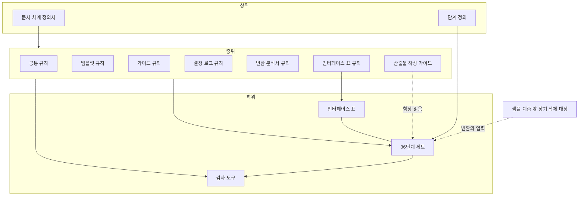
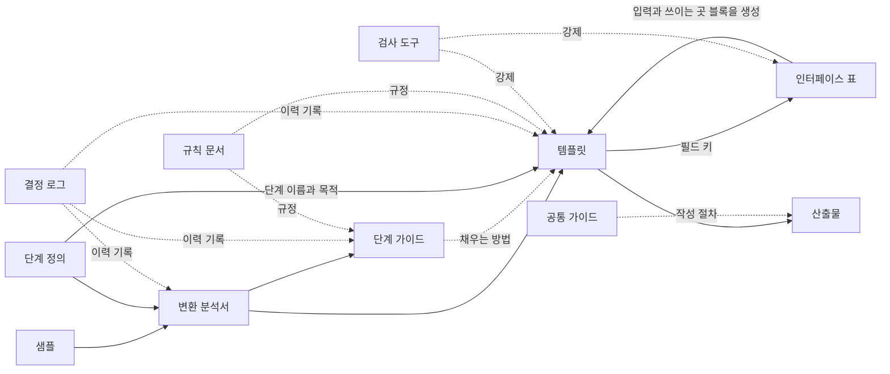

# 문서 체계 정의서

> 템플릿·가이드 문서 체계에서 **어떤 종류의 문서가 있고, 층이 어떻게 나뉘며, 각각 무엇을 담고, 누가 언제 읽는가**를 정의하는 최상위 문서다.
> 상태: v1.9 · 결정의 이유는 `docs/문서_체계_정의서_decision-log.md`에 있다(항목 ID는 DL-SD-nnn과 임시 로그에서 옮겨 온 DL-SYS-nnn). 할 일은 `docs/수정목록.md`에 있다.
> 이 문서는 **종류와 관계**를 정한다. 문서 종류별 작성 규칙의 상세는 규칙 문서(작업 순서 2단계)에서 정한다.
> **v1.1 변경:** 문서 계층(2절) 추가, 단계 정의 문서와 여섯 번째 문장 종류 추가, 샘플 취급 원칙(7절)과 폐기 표기(11절) 추가, 검사 도구의 위치 확정. 절 번호가 v1.0과 달라졌다(기존 3→4, 4→5, 5→6, 6→8, 7→9, 8→10).
> **v1.2 변경:** 가이드를 **공통 가이드(산출물 작성 가이드)** 와 **단계 가이드** 두 층으로 나누고 계층·문서 종류·읽는 사람·파일 위치·변경 절차·용어에 반영했다. 정의서의 결정 로그를 만들고 변경 이력 표를 추가했다. 절 번호는 v1.1과 같다.
> **v1.3 변경:** 산출물은 템플릿을 복사해 채우지 않고 참고해서 새로 쓰는 것으로 정했다(DL-SD-003). 이에 맞춰 산출물의 정의, 템플릿·가이드를 나누는 이유, 작성 에이전트의 정의를 고쳤다.

**변경 이력**

| 버전 | 날짜 | 요약 | 결정 ID |
|---|---|---|---|
| v1.0 | 2026-10-08 | 초안: 문서 종류, 귀속 기준, 독자, 변환 절차, 인터페이스 표, 위치, 변경 절차, 용어 | DL-SYS-008, 010~014, 016~018 |
| v1.1 | 2026-10-08 | 문서 계층, 단계 정의, 여섯 번째 문장 종류, 샘플 취급, 도구 위치, 폐기 표기, 파일명 접미사 | DL-SYS-019~025 |
| v1.2 | 2026-10-08 | 공통 가이드(산출물 작성 가이드) 추가, 정의서 결정 로그 생성, 변경 이력 표 추가 | DL-SD-001, DL-SD-002 |
| v1.3 | 2026-10-08 | 산출물은 템플릿을 참고해 새로 쓴다: 산출물·작성 에이전트 정의, 템플릿과 가이드를 나누는 이유 수정 | DL-SD-003 |
| v1.4 | 2026-10-08 | 정합성 정리: 구조 사실의 예에서 "필수 여부" 삭제, 13절 갱신 | DL-SD-004 |
| v1.5 | 2026-10-08 | 13절을 작성 현황을 나열하지 않는 형태로 바꿈 | DL-SD-005 |
| v1.6 | 2026-10-08 | 샘플은 수정하지 않고 오류·편향은 변환 분석서에 기록(7절), 용어 "매트릭스" 추가(12절) | DL-SD-006, DL-SD-007 |
| v1.7 | 2026-10-08 | 샘플 규칙 문서를 두지 않고 7절을 샘플 취급의 단일 출처로 함, 샘플 고유 단어 목록 추가 | DL-SD-008 |
| v1.8 | 2026-10-08 | 6절에서 샘플 해부의 분류 종류 나열을 삭제하고 규칙_변환분석서를 가리킴 | DL-CV-006 |
| v1.9 | 2026-10-08 | 파일 위치 표에 검사 도구의 결정 로그(`tools/tools-decision-log.md`) 추가 | DL-SD-012 |

---

## 1. 목적과 범위

**목적:** 신규 앱·웹 서비스의 기능 목록을 누락 없이, 근거를 갖고 도출하는 36단계 절차에서, 에이전트가 단계별 산출물을 안정적으로 작성하도록 돕는 문서 체계를 정한다.

**해결하려는 문제**
- 채워진 샘플을 주면 에이전트가 내용을 그대로 가져다 쓴다(예시 앵커링).
- 양식만 주면 어떻게 채우는지 몰라 근거 없는 값을 만든다.
- 문서마다 역할이 겹쳐 같은 내용이 여러 곳에 있고 서로 어긋난다.
- 결정의 이유가 대화에만 남아 사라진다.

**범위:** 36단계 각각의 산출물 문서와 이를 만들고 유지하는 문서. 36단계 절차 자체의 정의(각 단계의 번호·이름·목적·산출물)는 이 문서가 아니라 **단계 정의** 문서가 다룬다.

## 2. 문서 계층

윗층이 정하고 아랫층이 따른다. 각 층의 문서는 바로 위 층의 규정에서 파생된다.

| 층 | 문서 | 역할 |
|---|---|---|
| **상위** | 문서 체계 정의서(이 문서) | 문서 종류와 계층, 귀속 기준을 정한다 |
| | 단계 정의 | 36단계 각각의 번호·이름·목적·산출물을 정한다 |
| **중위** | 공통 규칙 | 모든 문서 종류에 공통인 규칙(출처 유형, 빈칸 금지, 용어 등) |
| | 템플릿 규칙 | 템플릿을 어떻게 쓰는가 |
| | 가이드 규칙 | 공통 가이드와 단계 가이드를 어떻게 쓰는가 |
| | 결정 로그 규칙 | 결정 로그를 어떻게 쓰는가 |
| | 변환 분석서 규칙 | 변환 분석서를 어떻게 쓰는가 |
| | 인터페이스 표 규칙 | 인터페이스 표를 어떻게 쓰고 검사하는가 |
| | 산출물 작성 가이드(공통 가이드) | 모든 단계에 공통인 산출물 작성 절차. 작성 에이전트가 항상 읽는다 |
| **하위** | 36단계 세트 | 단계마다 템플릿·단계 가이드·결정 로그·변환 분석서 |
| | 인터페이스 표 | 36개 세트가 함께 쓰는 공유 문서. 규칙은 중위에서 받는다 |
| | 검사 도구 | 규칙과 템플릿에 의존하는 가장 아래의 소비자 |
| **계층 밖** | 샘플 | 세트를 만들 때의 입력 자료. 장기적으로 삭제 대상(7절) |
| | 수정 목록 | 작업 운영용 할 일 목록 |

**결정 로그의 배치 원칙**
- 상위·중위의 문서마다 대응하는 결정 로그가 있다. 하위의 세트는 단계마다 결정 로그가 있다.
- 여러 문서에 걸친 결정은 영향을 받는 문서들의 **가장 가까운 공통 상위 문서의 로그**에 쓴다. 예를 들어 템플릿 규칙과 가이드 규칙에 모두 영향을 주는 결정은 정의서의 로그에 쓴다.
- 정의서의 로그는 `문서_체계_정의서_decision-log.md`에 있다(DL-SD-002). 그 밖의 문서에 속하는 항목 일부는 아직 임시 로그 `결정로그_체계.md`에 있고, 2단계에서 문서별 로그로 재배치한다(항목 ID는 유지하고 내용은 지우지 않는다).

## 3. 문서 종류

| 종류 | 정의 | 담는 문장 | 읽는 사람 | 작성 에이전트에게 | 최종 산출물에 남는가 | 갱신 방식 | 단위 |
|---|---|---|---|---|---|---|---|
| **문서 체계 정의서** | 문서 종류·계층·귀속 기준 | 종류와 관계 | 모두 | 제공 안 함 | 아니오 | 변경마다 결정 로그 | 체계 |
| **단계 정의** | 36단계 각각의 번호·이름·그룹·목적·산출물 | 절차 정의 | 유지보수자 | 제공 안 함(템플릿 머리말에 단계 이름·목적만 반영) | 아니오 | 변경마다 결정 로그 | 체계 전체 하나 |
| **규칙 문서** | 문서 종류별 작성 규칙(중위) | 규칙 | 유지보수자 | 공통 규칙 3절(값 규칙)만 제공 | 아니오 | 변경마다 결정 로그 | 종류별 |
| **템플릿** | 단계 산출물의 빈 양식 | 구조 사실 | 작성 에이전트 | **항상 제공** | 구조가 산출물에 반영됨(산출물은 템플릿을 참고해 새로 쓴다) | 버전 갱신, 변경마다 결정 로그 | 단계 |
| **공통 가이드** (산출물 작성 가이드) | 모든 단계에 공통인 산출물 작성 절차 | 절차·판단 지식 | 작성 에이전트 | **항상 제공** | 아니오 | 버전 갱신, 변경마다 결정 로그 | 체계 전체 하나 |
| **단계 가이드** | 한 단계의 템플릿을 어떻게 채우는지 설명 | 절차·판단 지식 | 작성 에이전트 | **항상 제공** | 아니오 | 버전 갱신, 변경마다 결정 로그 | 단계 |
| **결정 로그** | 문서를 그렇게 정한 이유의 이력 | 이력 | 유지보수자·검토자 | 기본 제공 안 함 | 아니오 | 추가만 함, 과거 항목은 고치지 않음 | 문서마다 |
| **변환 분석서** | 샘플을 템플릿으로 바꿀 때의 분석 기록 | 변환 증거 | 유지보수자 | 기본 제공 안 함 | 아니오 | 변환 시점에 고정, 이후 갱신 안 함 | 단계 |
| **인터페이스 표** | 단계 사이 필드 연결의 목록 | 관계 사실 | 유지보수자·검사 도구 | 템플릿의 생성 블록으로만 노출 | 아니오 | 원본 CSV 수정 → 도구가 문서 생성 | 체계 전체 하나 |
| **검사 도구** | 규칙을 코드로 강제 | — | 유지보수자 | 제공 안 함 | 아니오 | 코드 변경 | 체계 |
| **샘플** | 가상 서비스로 채운 완성 예(계층 밖) | (특정 주제의 값) | 유지보수자, 변환 입력 | **기본 제공 안 함** | 아니오 | 고정 | 단계(01~36) |
| **수정 목록** | 할 일 목록(계층 밖) | — | 유지보수자 | 제공 안 함 | 아니오 | 수시 | 체계 |

**산출물**은 템플릿의 구조를 따라 실제 프로젝트의 내용으로 새로 쓴 문서다(템플릿을 복사해 채우지 않는다). 위 문서 체계의 대상이 아니라 결과물이다.

**가이드**는 두 층이다. **공통 가이드**는 모든 단계에 걸친 작성 절차를, **단계 가이드**는 한 단계의 칸을 채우는 방법을 다룬다. 둘 다 작성 에이전트가 항상 읽는다.

### 3.1 단계 세트와 샘플

단계 하나(예: 4번 액터 목록)에는 **세트** 하나가 대응한다.

> 세트 = 템플릿 + 단계 가이드 + 결정 로그 + 변환 분석서

- 세트는 4문서다. 샘플은 세트의 일부가 아니라 세트와 짝이 되는 별도 종류다. 공통 가이드는 모든 세트가 함께 쓰며 세트에 속하지 않는다.
- 샘플은 처음부터 특정 주제(가상 서비스 "이웃장터")로 만들어졌으며 범용으로 만든 것이 아니다. 따라서 세트의 원본이 아니라 **변환의 입력**이다(6절).
- 36단계 전체에 세트 36개가 대응하고, 체계 문서(정의서, 단계 정의, 규칙 문서, 공통 가이드, 인터페이스 표)가 따로 있다.

### 3.2 종류 사이의 관계

## 4. 내용 귀속 기준

**원칙:** 문서를 목적이 아니라 **문장의 종류**로 나눈다. 모든 문장은 아래 여섯 종류 중 하나이고, 종류마다 집이 하나다. 같은 내용을 두 곳에 쓰지 않는다.

| 문장의 종류 | 예 | 집 |
|---|---|---|
| **절차 정의** — 이 단계가 무엇이고 무엇을 만드는가 | 단계 번호, 이름, 그룹, 목적, 산출물이 무엇인가 | 단계 정의 |
| **구조 사실** — 어떤 칸이 있고 모양이 어떤가 | 칸 이름, 열 순서, 값의 종류(자유 서술 / 닫힌 선택지 / ID 참조), 선택지 목록, ID 형식, 표 순서, 완료 체크 | 템플릿 |
| **절차·판단 지식** — 어떻게 찾고 판단하는가 | 도출 절차, 판단 기준, 흔한 실수, 모를 때의 처리, 입력을 읽는 법, 칸 의미의 해설 | 가이드 (모든 단계에 공통이면 공통 가이드, 한 단계에 특정하면 단계 가이드) |
| **관계 사실** — 다른 단계와 어떻게 이어지는가 | 이 필드를 어느 단계가 어떻게 쓰는가 | 인터페이스 표 |
| **이력** — 왜 그렇게 정했는가 | 결정 이유, 검토한 대안 | 결정 로그 |
| **변환 증거** — 샘플에서 무엇을 어떻게 바꿨는가 | 샘플 요소별 분류, 누락 탐색 결과 | 변환 분석서 |

**판별법**
1. 기계가 검사할 수 있으면(빈칸 여부, 선택지에 속하는가, ID 형식) 구조 사실이나 관계 사실이다. 판단이 필요하면 가이드다.
2. 문장에 **조건**("~이면", "~일 때", "~하지 않는다")이 있으면 가이드다.
3. 템플릿의 힌트는 **조건 없는 한 줄 설명**까지만 허용한다. 기준과 해설은 가이드로 보낸다.
4. 절차·판단이 모든 단계에 공통이면 공통 가이드에, 한 단계에 특정하면 그 단계의 단계 가이드에 쓴다.

**템플릿과 가이드를 나누는 가장 결정적인 이유는 산출물이 따르는 대상이 다르다는 점이다.** 산출물은 템플릿의 구조를 그대로 따르고 도구가 이를 검사하지만(TP-K13), 가이드는 산출물에 반영되지 않고 도구도 검사할 수 없다. 합치면 구조 검사의 대상이 흐려지고 가이드의 문장이 산출물에 섞일 위험이 생긴다. 예시와 해설을 값 칸에서 떨어뜨려 두어 복사 위험을 통제할 수 있다는 점도 이유다.

**관계 사실은 템플릿에 직접 쓰지 않는다.** 템플릿 머리말의 "입력 / 이 산출물이 쓰이는 곳" 블록은 인터페이스 표에서 도구가 생성한다("자동 생성, 직접 수정 금지"를 표시한다).

**단계 정의와 인터페이스 표의 경계:** 단계 정의는 단계가 무엇이고 무엇을 만드는지만 담는다. 단계 사이의 입력 관계("4단계는 1~3단계 산출물을 받는다")는 인터페이스 표에만 있다. 같은 사실을 두 곳에 쓰지 않기 위해서다.

**단계 정의의 출처:** 36단계는 외부의 검증된 표준이 아니라 이 프로젝트에서 도출한 절차다. 단계 정의 문서는 이 점과 출처 유형을 명시한다.

## 5. 누가 무엇을 읽는가

| 읽는 사람 | 읽는 문서 | 안 읽는 문서 |
|---|---|---|
| **작성 에이전트** (산출물을 채우는 에이전트) | 해당 단계의 템플릿과 단계 가이드, 공통 가이드, 이전 단계 산출물, 프로젝트 자료. 규칙 중 값을 채우는 규칙(공통 규칙 3절) | 결정 로그, 변환 분석서, 샘플, 단계 정의 원본, 인터페이스 표 원본, 검사 도구 |
| **유지보수자** (템플릿·가이드를 만들고 고치는 사람이나 에이전트) | 모든 문서 | — |
| **검토자** | 템플릿, 가이드, 결정 로그, 산출물 | 필요에 따라 |

- **공통 가이드와 단계 가이드는 모두 항상 읽는다.** 필요한지 판단하는 일을 에이전트에게 맡기지 않는다. 따라서 가이드는 항상 맥락에 올라간다는 전제로 쓰고, 길이 상한을 둔다(상한은 규칙 문서에서 정한다).
- **샘플을 기본으로 주지 않는다.** 필요해서 줄 때는 "구조만 참고" 표시와 서로 다른 도메인 2개 이상을 지킨다.
- 결정 로그와 변환 분석서를 작성 에이전트에게 주지 않는 이유는 맥락 비용과 앵커링 위험이다.

## 6. 샘플에서 세트를 만드는 절차

샘플은 특정 주제로 만들어졌으므로 **값만 지우면 범용 템플릿이 되지 않는다**. 한 번에 변환하면 도메인 누출, 누락, 과일반화, 구조 오류가 생긴다. 그래서 변환 분석서를 거친다.

| 순서 | 작업 | 산출물 |
|---|---|---|
| 1 | **단계 정의의 목적을 기준으로 삼는다.** 샘플이 아니라 단계 정의가 변환의 기준이다 | — |
| 2 | **샘플 해부.** 샘플의 요소(섹션, 표, 열, 질문, 규칙, ID 체계, 값)를 하나씩 분류하고(분류의 종류는 규칙_변환분석서 CV-07) 이유를 적는다 | 변환 분석서 ① |
| 3 | **누락 탐색.** 샘플에 없는 것을 샘플 밖에서 찾는다. 단계의 목적에 비추어 필요한 것이 샘플에 다 있는가, 성격이 다른 가상 도메인 2~3개를 대입해 칸이 부족하거나 의미가 어긋나는 곳이 있는가 | 변환 분석서 ② |
| 4 | **템플릿을 쓴다.** 템플릿의 각 변경은 분석서의 줄에 대응해야 한다. 대응이 없는 변경은 근거 없는 변경이다 | 템플릿 |
| 5 | **단계 가이드를 쓴다.** 템플릿의 모든 항목에 채우는 방법 해설이 있어야 한다 | 단계 가이드 |
| 6 | **인터페이스 표에 연결을 추가한다.** 템플릿 필드마다 소비자가 있거나 `최종 소비자 없음 + 사유`를 적는다 | 인터페이스 표 |
| 7 | **결정 로그에 기록한다.** 분석서의 중요한 판단을 로그 항목으로 올리고, 로그가 분석서의 해당 줄을 가리킨다 | 결정 로그 |
| 8 | **도메인 교체 시험.** 서로 다른 가상 도메인으로 실제로 채워 보고 샘플 단어 누출, 칸 부족, 빈칸 규칙 위반을 확인한다 | 시험 결과 |

**변환 분석서의 보존과 삭제:** 보존이 기본이다. 삭제는 허용한다. 삭제 전에 핵심을 결정 로그로 옮기고, 결정 로그와 인터페이스 표의 `근거` 칸에서 분석서를 가리키는 참조를 정리하고, 삭제 사실을 결정 로그에 기록한다. git 이력에 남으므로 복구할 수 있다. 다만 36단계를 모두 마치기 전에는 삭제를 권하지 않는다(템플릿을 크게 바꿀 때 누락 탐색을 다시 해야 할 수 있다). 변환 분석서에는 폐기 접미사(11절)를 붙이지 않는다.

## 7. 샘플 취급 원칙

샘플은 장기적으로 삭제될 입력 자료이며, 샘플이 공식 문서에 영향을 주어서는 안 된다. **샘플 취급의 단일 출처는 이 절이다.** 별도의 샘플 규칙 문서는 두지 않는다(DL-SD-008).

| 원칙 | 내용 |
|---|---|
| 계층 밖 | 샘플은 정의서에서 파생된 문서가 아니라 세트를 만들 때의 재료다 |
| 비참조 | 공식 문서(정의서, 단계 정의, 규칙 문서, 템플릿, 가이드, 인터페이스 표)는 샘플을 참조하거나 샘플에 의존하지 않는다. 36단계 정보를 샘플의 `00_README.md`에서 가져오지 않는다 |
| 예외 | 변환 분석서는 샘플을 해부하므로 샘플을 가리킬 수 있다. 샘플이 삭제되어도 읽을 수 있도록 **필요한 샘플 발췌를 분석서 안에 인용**한다 |
| 이력 문서 | 결정 로그는 샘플을 언급할 수 있다. 다만 샘플이 사라져도 이해되도록 필요한 내용을 로그 안에 쓴다 |
| 기본 제공 금지 | 작성 에이전트에게 기본으로 주지 않는다(5절) |
| 삭제 | 삭제 시점은 아래 조건을 만족한 뒤다: 36단계 세트가 완성되고, 공식 문서가 샘플을 참조하지 않으며, 변환 분석서에 필요한 발췌가 들어 있으며, 단계 정의가 샘플과 독립해 있다. 삭제 전 폐기 표기(11절)를 거친다 |
| 샘플 전용 도구 | `feature-list-sample/tools/`는 샘플을 생성·검증하는 도구이며 삭제해도 된다. 체계 도구는 별도 위치에 둔다(9절) |
| 고유 단어 | 샘플 고유 단어(서비스 이름, 특정 업종을 전제하는 용어)는 목록(`tools/data/sample_terms.txt`)으로 관리하고 산출물·템플릿·가이드에 쓰지 않는다(규칙_공통 CM-16, CM-17). 같은 업종의 프로젝트에서는 정당하게 쓸 수 있으므로 검사는 경고로 둔다 |
| 수정 금지 | 샘플의 오류(작성 순서 오류 등)와 도메인 편향은 샘플에서 고치지 않고 **변환 분석서에 기록**한다 |

## 8. 인터페이스 표

단계 사이의 연결을 **필드 수준**으로 모은 표다. 연결은 한 번만 적는다.

| 항목 | 정의 |
|---|---|
| 원본 | CSV(UTF-8, 첫 줄은 열 이름). 사람이 편집한다 |
| 읽기용 문서 | 도구가 CSV에서 생성한다 |
| 템플릿 블록 | 템플릿의 "입력 / 쓰이는 곳" 블록은 도구가 생성한다. 직접 수정하지 않는다 |
| 열 | 연결 ID, 보내는 필드(필드 키), 받는 단계, 받는 쪽 필드 또는 용도, 쓰이는 방식, 한 줄 설명, 필수, 방향, 근거 |
| 쓰이는 방식 | 닫힌 선택지: 축(행·열) / 참조(ID) / 집계 / 판단 입력 / 제약 / 근거 인용 |
| 방향 | `순행`(번호가 커지는 방향) / `환류`(뒤 단계의 결과가 앞 단계 산출물을 고치게 하는 흐름) |

**규칙 요지** (상세는 규칙 문서에서 정한다)
- 템플릿의 모든 필드는 표에 소비자가 한 줄 이상 있거나 `최종 소비자 없음 + 사유`를 가진다.
- 순행 연결은 보내는 단계 번호가 받는 단계 번호보다 작다.
- 환류는 `환류`로 선언한다. 환류가 일어나면 앞 단계 문서의 버전을 올리고 결정 로그에 기록한다.
- 한 개의 템플릿 필드는 **필드 키**로 가리킨다(형식은 규칙 문서에서 정한다).

## 9. 파일 위치와 이름

**파일명만으로 어느 문서의 어떤 종류인지 알 수 있어야 한다.** 파일을 단독으로 열어도 판별되도록 종류를 파일명 끝의 접미사로 쓴다.

| 규칙 | 내용 |
|---|---|
| 단계 세트 파일명 | `NN_이름_종류.md` (예: `04_액터목록_사람_template.md`) |
| 체계 문서의 결정 로그 | `<대상 문서 이름>_decision-log.md` (예: `문서_체계_정의서_decision-log.md`) |
| 종류 접미사 | `template`(템플릿) / `guide`(공통 가이드·단계 가이드) / `decision-log`(결정 로그) / `conversion`(변환 분석서) |
| 같은 단계 | `NN_이름`이 같은 파일은 같은 단계의 문서다 |
| 폴더 | 종류별 폴더(`templates/` 등)는 탐색용으로 유지한다. 파일명의 접미사와 폴더가 일치해야 한다 |

| 종류 | 위치 | 파일명 |
|---|---|---|
| 문서 체계 정의서 | `docs/` | `문서_체계_정의서.md` |
| 단계 정의 | `docs/` | `단계_정의.md` |
| 규칙 문서 | `docs/` | `규칙_<종류>.md` (공통, 결정로그, 템플릿, 가이드, 변환분석서, 인터페이스표) |
| 공통 가이드(산출물 작성 가이드) | `docs/` | `산출물_작성_guide.md` |
| 결정 로그(체계 문서용) | `docs/` | `<대상 문서 이름>_decision-log.md` (예: `문서_체계_정의서_decision-log.md`, `산출물_작성_guide_decision-log.md`). 일부 항목은 임시 `결정로그_체계.md`에 남아 있으며 재배치는 2단계 |
| 템플릿 | `templates/` | `NN_이름_template.md` |
| 단계 가이드 | `guides/` | `NN_이름_guide.md` |
| 결정 로그(단계) | `decision-logs/` | `NN_이름_decision-log.md` |
| 결정 로그(검사 도구) | `tools/` | `tools-decision-log.md` (알려진 한계도 이 파일에 둔다) |
| 변환 분석서 | `conversions/` | `NN_이름_conversion.md` |
| 인터페이스 표 원본 | `tools/data/` | `interfaces.csv` |
| 샘플 고유 단어 목록 | `tools/data/` | `sample_terms.txt` |
| 인터페이스 표 읽기용 | `docs/` | `단계_인터페이스.md`(생성) |
| 검사 도구(체계) | `tools/` | 내부 구성은 4단계에서 정함. **샘플 폴더 밖** |
| 수정 목록 | `docs/` | `수정목록.md` |
| 샘플 | `feature-list-sample/` | 현재 위치 그대로 |
| 샘플 전용 도구 | `feature-list-sample/tools/` | 샘플과 함께 삭제 가능 |

범용 초안 `feature-list-sample/04_액터목록_사람_범용.md`는 규칙 수립 전의 초안이다. 04번 세트를 만들 때 흡수하고, 7단계에서 폐기 표기를 한다(DL-SYS-007, 11절).

## 10. 변경 절차

무엇을 바꾸면 어디를 함께 고치는가.

| 바꾸는 것 | 함께 고칠 것 | 기록 |
|---|---|---|
| 단계 정의의 단계 추가·삭제·이름·목적 변경 | 해당 단계의 세트, 템플릿 머리말, 인터페이스 표 | 단계 정의의 결정 로그 |
| 템플릿의 필드 추가·삭제·이름 변경 | 가이드의 해당 해설, 인터페이스 표의 해당 필드 연결, 템플릿 생성 블록, 검사 도구 | 단계 결정 로그, 템플릿 버전 |
| 템플릿의 구조 변경(열·표 순서) | 가이드, 인터페이스 표(필드 키), 완료 체크, 검사 도구 | 단계 결정 로그, 템플릿 버전 |
| 단계 가이드의 해설·기준 변경 | 템플릿 힌트와 충돌 여부 확인 | 단계 결정 로그, 가이드 버전 |
| 공통 가이드의 절차·기준 변경 | 단계 가이드·템플릿과 충돌 여부 확인 | 공통 가이드의 결정 로그, 가이드 버전 |
| 인터페이스 표 연결 변경 | 받는 단계·보내는 단계 템플릿 생성 블록 재생성, 검사 도구 | 해당 로그 |
| 환류(뒤 단계가 앞 단계를 고침) | 앞 단계 템플릿 또는 산출물 버전 올림 | 앞 단계 결정 로그 |
| 규칙 문서 변경 | 영향받는 문서 종류의 재검사, 검사 도구 | 해당 규칙 문서의 결정 로그 |
| 이 정의서 변경 | 규칙 문서, 위 위치·이름 표 | 정의서의 결정 로그 |

**결정 로그 규칙:** 템플릿·가이드를 바꿀 때 대응하는 결정 로그 항목이 없으면 변경 검사가 실패한다(버전 번호와 로그 항목의 대응). 로그는 추가만 한다.

## 11. 폐기 표기

문서를 쓰지 않게 되어도 **실제로 삭제하지 않고 이름의 접미사로 상태를 표시**한다. 삭제는 사용자 확인 후에만 한다.

| 접미사 | 뜻 |
|---|---|
| `_outdated` | 내용이 새 문서로 대체되었고 더는 쓰이지 않는다 |
| `_삭제대상` | 삭제를 예정하고 있다 |

- 표시 단위는 **폴더 단위**를 기본으로 한다(예: 샘플 전체는 `feature-list-sample_삭제대상/`). 폴더 단위가 맞지 않으면 파일 단위로 표시한다.
- 변환 분석서는 접미사를 붙이지 않는다(6절).
- 샘플 전용 도구는 삭제해도 된다는 사용자의 허용이 있다.
- 접미사를 붙이면 파일 경로가 바뀌므로, 경로를 참조하는 도구가 있는지 먼저 확인한다.
- 표시 시점은 해당 시점이 되었을 때 사용자에게 확인한다.

## 12. 용어

| 용어 | 정의 |
|---|---|
| 단계 | 36단계 절차의 한 단계. 번호 NN으로 가리킨다 |
| 단계 정의 | 36단계 각각의 번호·이름·그룹·목적·산출물을 정한 상위 문서 |
| 세트 | 한 단계에 대응하는 템플릿·단계 가이드·결정 로그·변환 분석서 |
| 공통 가이드 | 모든 단계에 공통인 산출물 작성 절차를 담은 문서(산출물 작성 가이드). 모든 세트가 함께 쓴다 |
| 단계 가이드 | 한 단계의 템플릿을 어떻게 채우는지 설명하는 문서 |
| 샘플 | 특정 가상 서비스로 채운 완성 문서(현재 01~36번). 계층 밖의 입력 자료 |
| 산출물 | 템플릿의 구조를 따라 실제 프로젝트의 내용으로 새로 쓴 문서 |
| 필드 | 템플릿에서 값이 들어갈 칸 하나(보통 표의 열) |
| 필드 키 | 필드를 가리키는 고유 이름(단계 번호 포함) |
| 연결 | 인터페이스 표의 한 줄. 한 필드를 한 소비자가 쓰는 관계 |
| 매트릭스 | 행과 열이 교차하는 표. 칸마다 값을 하나씩 채운다(예: 액터×여정 단계). 이 체계의 문서에서는 "격자"라는 용어를 쓰지 않는다 |
| 순행 / 환류 | 앞에서 뒤로 넘겨 쓰기 / 뒤에서 앞으로 되돌려 고치기 |
| 예시 앵커링 | 에이전트가 예시의 내용·형식에 끌려 가거나 그대로 복사하는 현상(퓨샷 예시 편향, 복사 편향이라고도 함) |
| 작성 에이전트 | 템플릿을 참고해 산출물을 쓰는 에이전트 |
| 유지보수자 | 템플릿·가이드 등 문서 체계를 만들고 고치는 사람 또는 에이전트 |
| 폐기 표기 | 삭제 대신 파일·폴더 이름에 접미사를 붙여 상태를 나타내는 것 |

## 13. 이 문서가 정하지 않은 것

이 문서는 종류와 관계만 정한다. 아래는 다른 문서에서 정하며, 작성 현황은 `docs/수정목록.md`에서 관리한다.
- 문서 종류별 상세 작성 규칙 → `규칙_*.md`
- 공통 가이드와 단계 가이드의 실제 내용 → `산출물_작성_guide.md`, `guides/`
- 단계의 추가·삭제·순서 변경 규칙 → 규칙 문서
- 인터페이스 표 CSV의 열 정의 → 인터페이스 표 규칙
- 검사 도구의 내부 구성 → 도구 작성 단계
