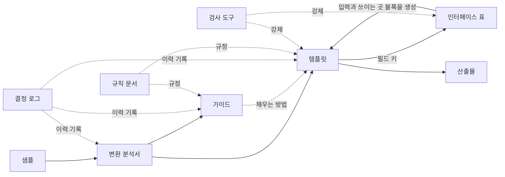

# 문서 체계 정의서

> 템플릿·가이드 문서 체계에서 **어떤 종류의 문서가 있고, 각각 무엇을 담으며, 누가 언제 읽는가**를 정의하는 최상위 문서다.
> 상태: v1.0 초안 · 결정의 이유는 `docs/결정로그_체계.md`(DL-SYS-nnn), 할 일은 `docs/수정목록.md`에 있다.
> 이 문서는 **종류와 관계**를 정한다. 문서 종류별 작성 규칙의 상세는 규칙 문서(작업 순서 2단계)에서 정한다.

---

## 1. 목적과 범위

**목적:** 신규 앱·웹 서비스의 기능 목록을 누락 없이, 근거를 갖고 도출하는 36단계 절차에서, 에이전트가 단계별 산출물을 안정적으로 작성하도록 돕는 문서 체계를 정한다.

**해결하려는 문제**
- 채워진 샘플을 주면 에이전트가 내용을 그대로 가져다 쓴다(예시 앵커링).
- 양식만 주면 어떻게 채우는지 몰라 근거 없는 값을 만든다.
- 문서마다 역할이 겹쳐 같은 내용이 여러 곳에 있고 서로 어긋난다.
- 결정의 이유가 대화에만 남아 사라진다.

**범위:** 36단계 각각의 산출물 문서와 이를 만들고 유지하는 문서. 36단계 절차 자체의 정의는 다루지 않는다(샘플 `00_README.md`의 36단계 표 참고).

## 2. 문서 종류

| 종류 | 정의 | 담는 문장 | 읽는 사람 | 작성 에이전트에게 | 최종 산출물에 남는가 | 갱신 방식 | 단위 |
|---|---|---|---|---|---|---|---|
| **템플릿** | 단계 산출물의 빈 양식 | 구조 사실 | 작성 에이전트 | **항상 제공** | 예(채워져 산출물이 됨) | 버전 갱신, 변경마다 결정 로그 | 단계 |
| **가이드** | 템플릿을 어떻게 채우는지 설명 | 절차·판단 지식 | 작성 에이전트 | **항상 제공** | 아니오 | 버전 갱신, 변경마다 결정 로그 | 단계 |
| **결정 로그** | 문서를 그렇게 정한 이유의 이력 | 이력 | 유지보수자·검토자 | 기본 제공 안 함 | 아니오 | 추가만 함, 과거 항목은 고치지 않음 | 단계별 + 체계 공통 |
| **변환 분석서** | 샘플을 템플릿으로 바꿀 때의 분석 기록 | 변환 증거 | 유지보수자 | 기본 제공 안 함 | 아니오 | 변환 시점에 고정, 이후 갱신 안 함 | 단계 |
| **인터페이스 표** | 단계 사이 필드 연결의 목록 | 관계 사실 | 유지보수자·검사 도구 | 템플릿의 생성 블록으로만 노출 | 아니오 | 원본 CSV 수정 → 도구가 문서 생성 | 체계 전체 하나 |
| **샘플** | 가상 서비스로 채운 완성 예 | (특정 주제의 값) | 유지보수자, 변환 입력 | **기본 제공 안 함** | 아니오 | 현재 고정 | 단계(01~36) |
| **규칙 문서** | 문서 종류별 작성 규칙 | 규칙 | 유지보수자 | 일부만 제공(2단계에서 범위 확정) | 아니오 | 변경마다 체계 공통 결정 로그 | 체계 |
| **검사 도구** | 규칙을 코드로 강제 | — | 유지보수자 | 제공 안 함 | 아니오 | 코드 변경 | 체계 |
| **문서 체계 정의서** | 이 문서 | 종류와 관계 | 모두 | 제공 안 함 | 아니오 | 변경마다 체계 공통 결정 로그 | 체계 |

**산출물**은 템플릿을 실제 프로젝트에 채운 문서다. 위 문서 체계의 대상이 아니라 결과물이다.

### 2.1 단계 세트와 샘플

단계 하나(예: 4번 액터 목록)에는 **세트** 하나가 대응한다.

> 세트 = 템플릿 + 가이드 + 결정 로그 + 변환 분석서

- 세트는 4문서다. 샘플은 세트의 일부가 아니라 세트와 짝이 되는 별도 종류다.
- 샘플은 처음부터 특정 주제(가상 서비스 "이웃장터")로 만들어졌으며 범용으로 만든 것이 아니다. 따라서 세트의 원본이 아니라 **변환의 입력**이다(5절).
- 36단계 전체에 샘플 36개와 세트 36개가 대응하고, 체계 공통 문서(결정 로그, 인터페이스 표, 규칙 문서, 이 정의서)가 따로 있다.

### 2.2 종류 사이의 관계

## 3. 내용 귀속 기준

**원칙:** 문서를 목적이 아니라 **문장의 종류**로 나눈다. 모든 문장은 아래 다섯 종류 중 하나이고, 종류마다 집이 하나다. 같은 내용을 두 곳에 쓰지 않는다.

| 문장의 종류 | 예 | 집 |
|---|---|---|
| **구조 사실** — 어떤 칸이 있고 모양이 어떤가 | 칸 이름, 열 순서, 필수 여부, 값의 종류(자유 서술 / 닫힌 선택지 / ID 참조), 선택지 목록, ID 형식, 표 순서, 완료 체크 | 템플릿 |
| **절차·판단 지식** — 어떻게 찾고 판단하는가 | 도출 절차, 판단 기준, 흔한 실수, 모를 때의 처리, 입력을 읽는 법, 칸 의미의 해설 | 가이드 |
| **관계 사실** — 다른 단계와 어떻게 이어지는가 | 이 필드를 어느 단계가 어떻게 쓰는가 | 인터페이스 표 |
| **이력** — 왜 그렇게 정했는가 | 결정 이유, 검토한 대안 | 결정 로그 |
| **변환 증거** — 샘플에서 무엇을 어떻게 바꿨는가 | 샘플 요소별 분류, 누락 탐색 결과 | 변환 분석서 |

**판별법**
1. 기계가 검사할 수 있으면(빈칸 여부, 선택지에 속하는가, ID 형식) 구조 사실이나 관계 사실이다. 판단이 필요하면 가이드다.
2. 문장에 **조건**("~이면", "~일 때", "~하지 않는다")이 있으면 가이드다.
3. 템플릿의 힌트는 **조건 없는 한 줄 설명**까지만 허용한다. 기준과 해설은 가이드로 보낸다.

**템플릿과 가이드를 나누는 가장 결정적인 이유는 수명이다.** 템플릿은 채워져서 산출물로 남고, 가이드는 남지 않는다. 합치면 가이드의 문장이 산출물에 섞이거나 지울 부분을 일일이 표시해야 한다. 그 밖에 템플릿은 도구가 구조를 검사할 수 있지만 가이드는 검사할 수 없다는 점, 예시와 해설을 값 칸에서 떨어뜨려 두어 복사 위험을 통제할 수 있다는 점도 이유다.

**관계 사실은 템플릿에 직접 쓰지 않는다.** 템플릿 머리말의 "입력 / 이 산출물이 쓰이는 곳" 블록은 인터페이스 표에서 도구가 생성한다("자동 생성, 직접 수정 금지"를 표시한다).

## 4. 누가 무엇을 읽는가

| 읽는 사람 | 읽는 문서 | 안 읽는 문서 |
|---|---|---|
| **작성 에이전트** (산출물을 채우는 에이전트) | 해당 단계의 템플릿, 가이드, 이전 단계 산출물, 프로젝트 자료. 규칙 중 값을 채우는 규칙(빈칸 금지, 출처 유형 등) | 결정 로그, 변환 분석서, 샘플, 인터페이스 표 원본, 검사 도구 |
| **유지보수자** (템플릿·가이드를 만들고 고치는 사람이나 에이전트) | 모든 문서 | — |
| **검토자** | 템플릿, 가이드, 결정 로그, 산출물 | 필요에 따라 |

- **가이드는 항상 읽는다.** 필요한지 판단하는 일을 에이전트에게 맡기지 않는다. 따라서 가이드는 항상 맥락에 올라간다는 전제로 쓰고, 길이 상한을 둔다(상한은 규칙 문서에서 정한다).
- **샘플을 기본으로 주지 않는다.** 필요해서 줄 때는 "구조만 참고" 표시와 서로 다른 도메인 2개 이상을 지킨다.
- 결정 로그와 변환 분석서를 작성 에이전트에게 주지 않는 이유는 맥락 비용과 앵커링 위험이다.

## 5. 샘플에서 세트를 만드는 절차

샘플은 특정 주제로 만들어졌으므로 **값만 지우면 범용 템플릿이 되지 않는다**. 한 번에 변환하면 도메인 누출, 누락, 과일반화, 구조 오류가 생긴다. 그래서 변환 분석서를 거친다.

| 순서 | 작업 | 산출물 |
|---|---|---|
| 1 | **단계의 목적을 기준으로 삼는다.** 36단계 표의 입력·산출물·이후 단계에서의 사용은 특정 서비스와 무관한 정의다 | — |
| 2 | **샘플 해부.** 샘플의 요소(섹션, 표, 열, 질문, 규칙, ID 체계, 값)를 하나씩 `구조 유지` / `일반화 필요` / `값이라 제거` / `순서 오류라 수정`으로 분류하고 이유를 적는다 | 변환 분석서 ① |
| 3 | **누락 탐색.** 샘플에 없는 것을 샘플 밖에서 찾는다. 단계의 목적에 비추어 필요한 것이 샘플에 다 있는가, 성격이 다른 가상 도메인 2~3개를 대입해 칸이 부족하거나 의미가 어긋나는 곳이 있는가 | 변환 분석서 ② |
| 4 | **템플릿을 쓴다.** 템플릿의 각 변경은 분석서의 줄에 대응해야 한다. 대응이 없는 변경은 근거 없는 변경이다 | 템플릿 |
| 5 | **가이드를 쓴다.** 템플릿의 모든 항목에 채우는 방법 해설이 있어야 한다 | 가이드 |
| 6 | **인터페이스 표에 연결을 추가한다.** 템플릿 필드마다 소비자가 있거나 `최종 소비자 없음 + 사유`를 적는다 | 인터페이스 표 |
| 7 | **결정 로그에 기록한다.** 분석서의 중요한 판단을 로그 항목으로 올리고, 로그가 분석서의 해당 줄을 가리킨다 | 결정 로그 |
| 8 | **도메인 교체 시험.** 서로 다른 가상 도메인으로 실제로 채워 보고 샘플 단어 누출, 칸 부족, 빈칸 규칙 위반을 확인한다 | 시험 결과 |

**변환 분석서의 보존과 삭제:** 보존이 기본이다. 삭제는 허용한다. 삭제 전에 핵심을 결정 로그로 옮기고, 결정 로그와 인터페이스 표의 `근거` 칸에서 분석서를 가리키는 참조를 정리하고, 삭제 사실을 결정 로그에 기록한다. git 이력에 남으므로 복구할 수 있다. 다만 36단계를 모두 마치기 전에는 삭제를 권하지 않는다(템플릿을 크게 바꿀 때 누락 탐색을 다시 해야 할 수 있다).

## 6. 인터페이스 표

단계 사이의 연결을 **필드 수준**으로 모은 표다. 연결은 한 번만 적는다.

| 항목 | 정의 |
|---|---|
| 원본 | CSV(UTF-8, 첫 줄은 열 이름). 사람이 편집한다 |
| 읽기용 문서 | 도구가 CSV에서 생성한다 |
| 템플릿 블록 | 템플릿의 "입력 / 쓰이는 곳" 블록은 도구가 생성한다. 직접 수정하지 않는다 |
| 열 | 연결 ID, 보내는 필드(필드 키), 받는 단계, 받는 쪽 필드 또는 용도, 쓰이는 방식, 한 줄 설명, 필수, 방향, 근거 |
| 쓰이는 방식 | 닫힌 선택지: 축(행·열) / 참조(ID) / 집계 / 판단 입력 / 제약 / 근거 인용 |
| 방향 | `순행`(번호가 커지는 방향) / `환류`(뒤 단계의 결과가 앞 단계 산출물을 고치게 하는 흐름) |

**규칙 요지** (상세는 규칙 문서에서 정한다)
- 템플릿의 모든 필드는 표에 소비자가 한 줄 이상 있거나 `최종 소비자 없음 + 사유`를 가진다.
- 순행 연결은 보내는 단계 번호가 받는 단계 번호보다 작다.
- 환류는 `환류`로 선언한다. 환류가 일어나면 앞 단계 문서의 버전을 올리고 결정 로그에 기록한다.
- 한 개의 템플릿 필드는 **필드 키**로 가리킨다(형식은 규칙 문서에서 정한다).

## 7. 파일 위치와 이름

같은 단계 번호와 이름을 쓰는 파일은 같은 단계의 문서다. 샘플 파일명을 그대로 따른다(예: `04_액터목록_사람.md`).

| 종류 | 위치 | 파일명 |
|---|---|---|
| 템플릿 | `templates/` | `NN_이름.md` |
| 가이드 | `guides/` | `NN_이름.md` |
| 결정 로그(단계) | `decision-logs/` | `NN_이름.md` |
| 변환 분석서 | `conversions/` | `NN_이름.md` |
| 결정 로그(체계 공통) | `docs/` | `결정로그_체계.md` |
| 인터페이스 표 원본 | 4단계에서 도구와 함께 위치 확정 | `interfaces.csv` |
| 인터페이스 표 읽기용 | `docs/` | `단계_인터페이스.md`(생성) |
| 규칙 문서 | `docs/` | `규칙_*.md` |
| 문서 체계 정의서, 수정 목록 | `docs/` | `문서_체계_정의서.md`, `수정목록.md` |
| 샘플 | `feature-list-sample/` | 현재 위치 그대로 |
| 검사 도구 | `feature-list-sample/tools/`(현재). 체계 도구의 위치는 4단계에서 확정 | |

범용 초안 `feature-list-sample/04_액터목록_사람_범용.md`는 규칙 수립 전의 초안이며, 04번 세트를 만들 때 흡수하고 7단계에서 처리한다(DL-SYS-007).

## 8. 변경 절차

무엇을 바꾸면 어디를 함께 고치는가.

| 바꾸는 것 | 함께 고칠 것 | 기록 |
|---|---|---|
| 템플릿의 필드 추가·삭제·이름 변경 | 가이드의 해당 해설, 인터페이스 표의 해당 필드 연결, 템플릿 생성 블록 | 단계 결정 로그, 템플릿 버전 |
| 템플릿의 구조 변경(열·표 순서) | 가이드, 인터페이스 표(필드 키), 완료 체크 | 단계 결정 로그, 템플릿 버전 |
| 가이드의 해설·기준 변경 | 템플릿 힌트와 충돌 여부 확인 | 단계 결정 로그, 가이드 버전 |
| 인터페이스 표 연결 변경 | 받는 단계·보내는 단계 템플릿 생성 블록 재생성 | 체계 공통 결정 로그 또는 단계 결정 로그 |
| 환류(뒤 단계가 앞 단계를 고침) | 앞 단계 템플릿 또는 산출물 버전 올림 | 앞 단계 결정 로그 |
| 규칙 문서 변경 | 영향받는 문서 종류의 재검사 | 체계 공통 결정 로그 |
| 이 정의서 변경 | 규칙 문서, 위 위치·이름 표 | 체계 공통 결정 로그 |

**결정 로그 규칙:** 템플릿·가이드를 바꿀 때 대응하는 결정 로그 항목이 없으면 변경 검사가 실패한다(버전 번호와 로그 항목의 대응). 로그는 추가만 한다.

## 9. 용어

| 용어 | 정의 |
|---|---|
| 단계 | 36단계 절차의 한 단계. 번호 NN으로 가리킨다 |
| 세트 | 한 단계에 대응하는 템플릿·가이드·결정 로그·변환 분석서 |
| 샘플 | 특정 가상 서비스로 채운 완성 문서(현재 01~36번) |
| 산출물 | 템플릿을 실제 프로젝트에 채운 문서 |
| 필드 | 템플릿에서 값을 채우는 칸 하나(보통 표의 열) |
| 필드 키 | 필드를 가리키는 고유 이름(단계 번호 포함) |
| 연결 | 인터페이스 표의 한 줄. 한 필드를 한 소비자가 쓰는 관계 |
| 순행 / 환류 | 앞에서 뒤로 넘겨 쓰기 / 뒤에서 앞으로 되돌려 고치기 |
| 예시 앵커링 | 에이전트가 예시의 내용·형식에 끌려 가거나 그대로 복사하는 현상(퓨샷 예시 편향, 복사 편향이라고도 함) |
| 작성 에이전트 | 템플릿을 채워 산출물을 만드는 에이전트 |
| 유지보수자 | 템플릿·가이드 등 문서 체계를 만들고 고치는 사람 또는 에이전트 |

## 10. 이 문서가 정하지 않은 것

규칙 문서(2단계)에서 정한다.
- 문서 종류별 상세 작성 규칙(공통 / 템플릿 / 가이드 / 결정 로그 / 변환 분석서 / 인터페이스 표)
- 결정 로그 항목 형식의 확정
- 가이드 길이 상한
- 필드 키의 형식
- 작성 에이전트에게 제공할 규칙의 범위
- 인터페이스 표 CSV의 열 정의 확정
