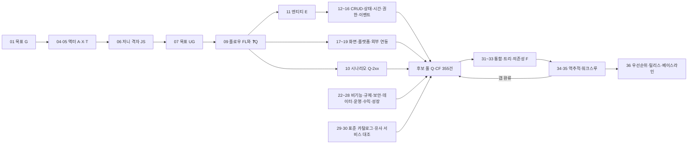

# 신규 앱/웹 서비스 Full Feature List 도출 — 단계별 산출물 샘플

> **가상 서비스 "이웃장터"**(동네 기반 중고거래 앱)로 작성한 샘플 문서 모음입니다. 실제 서비스·시장·법령 정보가 아니며, **산출물의 형식·연결 방식·검증 방법**을 보여주기 위한 예시입니다. 법령·스토어 정책·보존 기간·수치는 모두 샘플 가정이므로 실제 프로젝트에서는 직접 조사하고 법무 확인을 거치세요.

## 이 폴더의 사용법

- **파일명의 두 자리 번호 = 단계 번호(01~36).** 예: `04_액터목록_사람.md`는 4단계(액터 목록) 산출물입니다.
- 각 문서의 맨 위 표에 **입력 / 산출물 / 이 산출물이 쓰이는 곳**이 적혀 있고, 맨 아래에 **완료 기준 체크**가 있습니다.
- 문서 사이는 **ID로 연결**됩니다. ID를 검색하면 상류(근거)와 하류(쓰임)를 따라갈 수 있습니다.
- 다이어그램은 Mermaid 문법입니다(Mermaid를 지원하는 뷰어에서 그림으로 보입니다).

## 예시 서비스

> 같은 동네 이웃끼리 안 쓰는 물건을 직거래로 사고팔 때, 사기·약속 조율·번호 노출의 부담을 **동네 인증 + 앱 내 채팅 + 거래 후기(매너 점수)** 로 줄여 주는 모바일 앱 (iOS·Android + 관리자 웹, MVP 12주, 개발 5명).

## 한눈에 보는 연결 구조



## 규모 요약

| 항목 | 수 |
|---|---|
| 비즈니스 목표 G / 가설 H | 6 / 5 |
| 액터(사람 6 + 외부 시스템 7 + 시간 1) | 14 |
| 사용자 목표 UG (코어 구간 목표 포함) | 67 |
| 유저 플로우 FL | 12 |
| 후보 풀 (❓ Q 162건 + 단계별 CF 193건) | **355** |
| 의도적 제외 후보 | 12 |
| 엔티티 E | 27 |
| 화면 SCR | 62 |
| **Feature List v1.0 기능 F** | **146** (공통 67 · 고유 79) |
| 릴리스 | MVP 99 · R1 34 · Later 13 |

## 36단계 파일 목록 (입력 → 산출물 → 쓰이는 곳)

| # | 파일 | 그룹 | 입력 | 산출물 | 이 산출물이 쓰이는 곳 |
|---|---|---|---|---|---|
| 1 | [01_목표_가치.md](01_목표_가치.md) | A. 프레임·근거 | 아이디어, 사업 맥락, 이해관계자 기대 | 목표(Goal) ID + 지표, 가치제안, 핵심 가설 | 02(범위 판단 기준) · 03(검증할 가설) · 27·28(수익·성장 기능의 출발점) · 34(목표↔기능 양방향 추적) · 36(우선순위 근거) |
| 2 | [02_범위_제약.md](02_범위_제약.md) | A. 프레임·근거 | 01(목표·가치), 기한·예산·팀 | In/Out/Later 목록, 플랫폼 후보, 제약·가정·의존성·리스크 로그 | 04·05(액터 도출의 경계) · 18·22(플랫폼·품질 기준의 상한) · 29·30(Out 항목을 "의도적 제외"로 판정하는 기준) · 36(릴리스 분할) |
| 3 | [03_근거수집.md](03_근거수집.md) | A. 프레임·근거 | 01의 가설, 02의 범위 | 인사이트 DB, 유사 서비스 기능표, 규제·정책 목록, 기술 제약 메모 | 04~07(액터·목표 시드) · 22·23(요구의 원천) · 30(대조 대상) · 36(우선순위 근거) |
| 4 | [04_액터목록_사람.md](04_액터목록_사람.md) | B. 주체 | 01(목표), 02(범위), 03(사용자 조사) | 사람 액터 목록(역할 단위) | 06(격자의 행) · 08(공통/고유 판정 단위) · 15(권한 매트릭스의 축) · 26(운영 액터의 도구 도출) |
| 5 | [05_액터목록_비사람.md](05_액터목록_비사람.md) | B. 주체 | 02(범위·제약), 03(기술 제약) | 외부 시스템·시간 액터 목록 + 컨텍스트 다이어그램 | 07(외부·시간 액터의 목표 도출) · 14(시간 액터 → 배치 기능) · 19(연동 기능 도출) · 23(결제사·스토어 정책 확인 대상) |
| 6 | [06_저니_격자.md](06_저니_격자.md) | C. 행동 | 04(사람 액터), 03(인사이트), 생애주기 템플릿(발견→탈퇴 + 문제 상황 + 운영 업무) | 액터×단계 격자(행동·터치포인트·불편, 코어 구간 표시) | 07(칸마다 목표 도출) · 09(코어 구간 플로우 우선) · 28(성장 단계 기능 도출) · 34(모든 칸이 처리됐는지 검사) |
| 7 | [07_목표목록.md](07_목표목록.md) | C. 행동 | 06(격자), 05(외부·시간 액터) | 목표 목록(ID · 액터 · 단계 · 격자 칸) | 08(공통/고유 판정) · 09(목표 1개당 플로우 1장) · 34(목표→플로우→기능 추적) |
| 8 | [08_액터_공통고유.md](08_액터_공통고유.md) | C. 행동 | 07(목표 목록) | 공통/고유 태그가 붙은 목표 목록 (공통 목표는 1회만 정의) | 09(공통 플로우는 한 번만 그림) · 15(공통은 전 역할 허용, 고유는 제한하는 권한 설계) · 32(액터 태그) |
| 9 | [09_유저플로우.md](09_유저플로우.md) | C. 행동 | 07(목표 목록), 08(공통/고유 판정) | 플로우 다이어그램 12개(FL-01~FL-12), **❓ 목록(Q-001~Q-130)**, 등장한 명사·상태·화면 | ❓ → 후보 풀(31에서 통합) · 명사 → 11 · 상태 → 13 · 화면 → 17 · 10(시나리오 점검 대상) · 35(워크스루의 원본) |
| 10 | [10_시나리오_5유형.md](10_시나리오_5유형.md) | C. 행동 | 09(플로우와 ❓ 목록) | 예외·오남용·복구 관점의 ❓ 추가분(Q-201~Q-232) | 후보 풀로 합류(31) · 24(위협 목록의 시드) · 13(복구 전이의 시드) |
| 11 | [11_엔티티.md](11_엔티티.md) | D. 대상 | 09·10(플로우의 명사) | 엔티티 목록(E-01~E-27) + 용어집 | 12·13·15·16·25(표의 행) · 21(영역 구성 기준) · 31(용어 통일) |
| 12 | [12_CRUD_매트릭스.md](12_CRUD_매트릭스.md) | D. 대상 | 11(엔티티 E-01~E-27) | 엔티티별 CRUD+ 표(빈 칸 = 기능 후보 또는 N/A + 사유) | 빈 칸 → 후보 풀 · 17(목록·상세·편집 화면 도출) · 26(관리자 데이터 관리 기능) · 34(빈 칸 검사) |
| 13 | [13_상태_전이.md](13_상태_전이.md) | D. 대상 | 09(플로우), 11(엔티티) | 엔티티별 상태도, 전이 트리거 목록(사용자/시스템/시간/운영) | 트리거 없는 전이 → 후보 풀 · 14(시간 트리거 전달) · 16(상태 변경 = 이벤트) · 26(운영 처리 흐름) · 34(전이→기능 검사) |
| 14 | [14_시간_주기.md](14_시간_주기.md) | D. 대상 | 13(시간 트리거 전이), 05(T-01 시간 액터), 07(UG-090~UG-101) | 만료·갱신·리마인더·배치 기능 목록(TM-01~TM-22) | 후보 풀로 합류 · 20(스케줄러를 공통 기능으로 판정) · 22(배치 성능·모니터링 기준) |
| 15 | [15_소유_권한.md](15_소유_권한.md) | D. 대상 | 04(사람 액터), 08(공통/고유), 11(엔티티), 12(CRUD+) | 권한 매트릭스(액터×행위), 사용자 상태별 제한 표, 소유·공유·위임·승인 규칙 | 후보 풀로 합류 · 17(화면별 접근 제어) · 20(권한·역할을 공통으로 판정) · 24(접근 통제 위협 점검) · 26(권한 관리 도구) |
| 16 | [16_이벤트.md](16_이벤트.md) | D. 대상 | 09(플로우), 13(상태 전이) | 이벤트 목록(발생 기능 · 소비 기능: 알림·로그·분석·후속 처리) | 소비 기능 → 후보 풀 · 28(트래킹 이벤트 계획) · 33(알림·로그 공통 기능과의 `uses` 관계) |
| 17 | [17_화면_UI상태.md](17_화면_UI상태.md) | E. 구조 | 09(플로우), 12(CRUD+), 15(권한) | 화면 인벤토리(화면 ↔ 목표 ↔ 후보), 화면별 비정상 상태 목록 | 누락 화면·상태 → 후보 풀 · 34(화면↔기능 양방향 검사) · 35(프로토타입의 기초) · (36 이후) 와이어프레임·IA의 입력 |
| 18 | [18_플랫폼_채널.md](18_플랫폼_채널.md) | E. 구조 | 02(플랫폼 후보 P-01~P-03), 09(플로우), 17(화면) | 플랫폼별 차이 기능 목록 | 후보 풀로 합류 · 32(플랫폼 태그) · 36(플랫폼별 릴리스 분할) |
| 19 | [19_외부연동.md](19_외부연동.md) | E. 구조 | 05(외부 시스템 액터 X-01~X-07) | 연동 기능 목록(연동·설정·장애·재시도·모니터링) | 후보 풀로 합류 · 22(가용성 요구의 근거) · 33(`uses` 관계) · 34(외부 액터→기능 검사) |
| 20 | [20_도메인_공통고유.md](20_도메인_공통고유.md) | E. 구조 | 8~19단계의 후보 풀(Q-001~Q-130, Q-201~Q-232, CF-12~CF-19) | 공통/고유 판정이 붙은 후보, 공통 기능 목록 v0.1 | 21(공통 영역과 고유 영역 분리) · 29(공통 카탈로그와 대조) · 33(`uses` 관계) · 36(공통 선행 순서) |
| 21 | [21_영역_모듈.md](21_영역_모듈.md) | E. 구조 | 11(엔티티), 20(공통/고유 판정) | L1 영역 구성(영역 코드, 책임 엔티티, 포함 목표) | 31(병합 시 분류 틀) · 32(트리의 최상위) · 34(엔티티·목표의 영역 배정 검사) |
| 22 | [22_비기능_품질.md](22_비기능_품질.md) | F. 제약·횡단 | 02(범위·제약), 03(기술 제약), 14(배치), 18(플랫폼), 19(외부 연동) | 측정 가능한 NFR 목록(+ 기능으로 승격된 항목) | 승격분 → 후보 풀 · 나머지는 (36 이후) 인수조건과 비기능 테스트 기준 |
| 23 | [23_규제_정책.md](23_규제_정책.md) | F. 제약·횡단 | 03(규제·정책 목록 RG-01~RG-16), 05(결제사·스토어 액터) | 규제 항목 → 기능/프로세스 매핑표 | 후보 풀로 합류(동의, 삭제 등) · 34(규제→기능 검사) · 36(필수 게이트) |
| 24 | [24_보안_어뷰징.md](24_보안_어뷰징.md) | F. 제약·횡단 | 10(오남용 ❓), 11(엔티티), 15(권한) | 위협 목록과 방어 기능 | 후보 풀로 합류 · 22(보안 NFR 근거) · 26(모더레이션·제재 도구) |
| 25 | [25_데이터_생애.md](25_데이터_생애.md) | F. 제약·횡단 | 11(엔티티), 23(규제) | 엔티티별 보존·백업·이전·삭제 정책과 기능 | 후보 풀로 합류 · 22(복구 목표 근거) · 36(필수 게이트: 삭제권 등) |
| 26 | [26_운영_백오피스.md](26_운영_백오피스.md) | G. 운영·사업 | 04(운영 액터), 06(JS-8·JS-10 운영 저니), 12(CRUD+), 13(상태·전이), 16(이벤트) | 운영 업무 목록과 필요한 도구(화면·기능) | 후보 풀로 합류 · 20(백오피스 공통 판정) · 15(운영자 권한 반영) · 34(운영 액터의 목표 처리 검사) |
| 27 | [27_수익모델.md](27_수익모델.md) | G. 운영·사업 | 01(수익 모델 선언), 02(범위) | 돈이 오가는 모든 지점의 해당 여부, 사유, 재검토 트리거 | 후보 풀로 합류 · 20(결제 공통 판정) · 23(결제 관련 규제 확인) · 36(우선순위) |
| 28 | [28_성장_측정.md](28_성장_측정.md) | G. 운영·사업 | 01(지표 G-01~G-06), 06(저니 단계), 16(이벤트) | 성장 기능과 트래킹 이벤트 계획 | 후보 풀로 합류 · (36 이후) 분석 스펙의 원천 |
| 29 | [29_표준카탈로그_대조.md](29_표준카탈로그_대조.md) | H. 대조(외부 기준) | 20(공통 기능 목록), 후보 풀 전체, 표준 공통 기능 카탈로그 | 항목별 채택/제외 판정, 갭 목록 | 갭 → 후보 풀 추가 또는 해당 단계로 환류 · 34(판정 누락 검사) |
| 30 | [30_유사서비스_대조.md](30_유사서비스_대조.md) | H. 대조(외부 기준) | 03(유사 서비스 기능표·인사이트), 후보 풀 전체 | 항목별 채택/제외 판정, 갭 목록, Kano 분류 | 29와 동일(갭 → 후보 풀) · 36(우선순위: Kano 판단 근거) |
| 31 | [31_통합_정규화.md](31_통합_정규화.md) | I. 통합·관리 | 9~30단계의 후보 풀 전부(Q-001~Q-232, CF-12~CF-30), 11의 용어집 | Feature List v0 — 후보 355건을 중복·동의어 병합해 기능 목록으로 정리 | 32(트리화 대상) · 34(검증 대상) |
| 32 | [32_계층_ID_태그.md](32_계층_ID_태그.md) | I. 통합·관리 | 31(Feature List v0), 21(영역 구성) | L1~L3 트리, 기능 ID, 근거 ID, 태그(액터·저니 단계·플랫폼·공통/고유) | 33(의존성 입력) · 34(근거 ID로 역추적) · 36(태그로 릴리스 뷰 필터링) |
| 33 | [33_의존성.md](33_의존성.md) | I. 통합·관리 | 32(기능 트리), 20(공통 기능 목록) | `uses`(공통 기능 호출)·선후행 관계, 구현 웨이브 | 34(양방향 검사: 호출처 없는 공통 기능 = 과잉, 정의 없는 `uses` = 누락) · 36(릴리스 순서: 공통 선행) |
| 34 | [34_역추적_검증.md](34_역추적_검증.md) | J. 검증·확정 | 32·33(Feature List), 1~30의 산출물 전부 | 추적 매트릭스, 갭 로그, 의도적 제외 목록(사유), 커버리지 리포트 | 갭 → 해당 단계로 환류 · 35(리뷰 자료) · 36(베이스라인 근거) · (이후) 변경 영향 분석 |
| 35 | [35_워크스루_리뷰.md](35_워크스루_리뷰.md) | J. 검증·확정 | 34(역추적 결과), 09(플로우), 17(화면·프로토타입) | E2E 워크스루 결과, 역할별 리뷰 의견, 신규 발견 수, Feature List v1.0 후보 | 신규 발견 → 환류(32 갱신) · 신규 발견이 0 근처이면 종료 조건 충족 → 36 |
| 36 | [36_우선순위_릴리스.md](36_우선순위_릴리스.md) | J. 검증·확정 | 35의 v1.0 후보, 1(목표), 3(조사), 33(의존성), 23·25(필수 게이트), 개발 공수 추정 | 우선순위, MVP·릴리스 로드맵, 컷라인, 출시 게이트, 베이스라인(Feature List v1.0) | (Feature List 이후) PRD 기능 요구, 스토리·인수조건, 화면 설계, API 계약, 개발·QA 계획의 입력 · 이후 변경요청의 판단 기준 |

## ID 접두사 사전

| 접두사 | 의미 | 정의된 문서 |
|---|---|---|
| G / H / RK | 비즈니스 목표 / 가설 / 리스크 | 01, 02 |
| OUT / LT / C / AS / DP / P | 범위 밖 / Later / 제약 / 가정 / 의존성 / 플랫폼 | 02 |
| IN / CMP / RG / TC | 사용자 인사이트 / 유사 서비스 기능 / 규제 / 기술 제약 | 03 |
| A / PS | 사람 액터 / 페르소나 | 04 |
| X / T | 외부 시스템 액터 / 시간 액터 | 05 |
| JS | 생애주기 단계(저니) | 06 |
| UG | 사용자 목표 | 07 |
| FL | 유저 플로우 | 09 |
| Q | ❓ 기능 후보(Q-001~Q-130는 09번, Q-201~Q-232는 10번) | 09, 10 |
| E | 엔티티 | 11 |
| TR / TM / EV | 상태 전이 / 타이머 / 이벤트 | 13, 14, 16 |
| OWN·SHR·DLG·APR·BLK | 소유·공유·위임·승인·차단 규칙 | 15 |
| SCR | 화면 | 17 |
| COM | 공통 기능(영역 수준 초안) | 20 |
| NF | 비기능 요구 | 22 |
| TH | 위협 | 24 |
| DL | 데이터 생애 정책 | 25 |
| OP / MN / AE | 운영 업무 / 수익 지점 / 분석 이벤트 | 26, 27, 28 |
| CAT | 표준 카탈로그 항목 | 29 |
| CF-단계-번호 | 단계별 신규 후보(예: CF-12-03은 12번에서 나온 3번째 후보) | 12~30 |
| F-영역-번호 | **기능(최종)** | 31, 32 |
| GAP / WT / R35 | 갭 / 워크스루 / 35번 발견 사항 | 34, 35 |
| PG / CR | 출시 게이트 / 변경요청 | 36 |

## 생성·검증 도구 (tools/)

31~36번과 이 README는 [tools/](tools/)의 프로그램이 기능 명세 데이터에서 만든 문서이고, 1~30번은 직접 작성한 문서입니다. 문서 전체의 ID 연결과 숫자는 검사 프로그램으로 확인합니다. 자세한 설명은 [tools/README.md](tools/README.md)를 보세요.

```bash
python3 feature-list-sample/tools/verify.py   # ID 연결·숫자 검사 (전부 통과하면 종료 코드 0)
python3 feature-list-sample/tools/build.py    # 31~36번과 00_README.md 다시 생성
```

## 검증 방법과 한계

- **스크립트로 확인한 것:** 후보 355건이 모두 기능 또는 제외 사유로 처리됨(미처리·중복 0건) · 목표 67개의 기능 연결 · 저니 격자 30칸의 목표 연결 · 화면 62개와 기능의 양방향 연결 · `uses`·선후행 참조 무결성과 순환 없음 · 영역·엔티티·목표 배정 · 문서에 적은 숫자 집계.
- **사람이 대조해서 확인한 것:** CRUD 매트릭스·권한 매트릭스와 기능 목록의 의미상 일치(34번 GAP-02, GAP-03).
- **작성 중 실제로 발견해 고친 것:** 문서에 잘못 적은 집계 숫자 4건(13·22·23·30번), 모호한 N/A 사유 4칸(06번), 화면 누락 3건(SCR-43·SCR-44·SCR-A18), 기능 누락 1건(F-SUP-011), 액터 불일치 1건(F-ADM-003), 우선순위 의존성 위반 4건(36번), 워크스루·리뷰에서 추가된 기능 4건(35번).
- **근거 등급:** 이 샘플의 뿌리 항목(인터뷰·유사 서비스·규제 등)은 전부 가상이라 기능 146개가 모두 "미검증"입니다(32번). 연결 구조는 실제 근거를 넣을 때 그대로 쓸 수 있지만, 지금 목록 자체는 근거가 없습니다.
- **한계:** 이 폴더는 가상 데이터라 현실의 시장·법령 정확성을 보장하지 않습니다. 목록의 "빠짐없음"은 증명할 수 없고, 정의한 관점(17개 역추적 규칙)에 대한 커버리지와 신규 발견 포화(35번)로 근거를 삼습니다.

## 읽는 순서 제안

1. 이 문서 → **36번**(결과) → **32번**(Feature Tree)로 전체 모습을 먼저 본다.
2. **06 → 07 → 09**(저니 → 목표 → 유저 플로우)로 기능이 어떻게 도출되는지 따라간다.
3. **34 → 35**(역추적·워크스루)로 누락을 어떻게 잡는지 본다.
