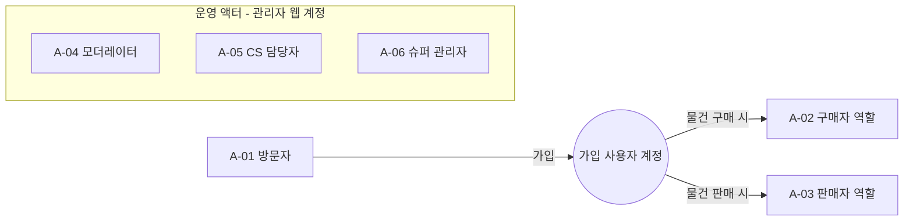

# 04. 액터 목록 (사람)

> **샘플 문서** · 가상 서비스 "이웃장터" 기준 · 작성일 2026-10-06 · v1.0 · 작성 PM(가상) · 상태 승인

| 구분 | 내용 |
|---|---|
| 단계 | 4 / 36 — B. 주체 |
| 입력 | 01(목표), 02(범위), 03(사용자 조사) |
| 산출물 | 사람 액터 목록(역할 단위) |
| 이 산출물이 쓰이는 곳 | 06(격자의 행) · 08(공통/고유 판정 단위) · 15(권한 매트릭스의 축) · 26(운영 액터의 도구 도출) |

> **액터는 사람이 아니라 "역할"입니다.** A-02(구매자)와 A-03(판매자)는 같은 계정이 상황에 따라 맡는 역할이며, 서로 다른 사용자가 아닙니다.

---

## 1. 도출 질문(체크)

| 질문 | 답 | 결과 액터 |
|---|---|---|
| 서비스를 쓰는 사람은 누구인가? | 앱을 둘러보는 사람, 가입한 사람 | A-01, A-02, A-03 |
| 콘텐츠·상품을 공급하는 사람은 누구인가? | 물건을 파는 사람 | A-03 |
| 서비스를 운영하는 사람은 누구인가? | 신고·제재 담당, 문의 담당, 시스템 전체 관리자 | A-04, A-05, A-06 |
| 로그인 전의 사람은 누구인가? | 방문자 | A-01 |
| 대신해서 동의·결제하는 사람이 있는가? | 없음 (만 14세 미만 가입 불가, OUT-05) | — |
| 사용자는 아니지만 영향을 주는 사람은? | 경영진·법무·개발·마케팅 → 아래 7절(이해관계자) | — |

## 2. 사람 액터 목록

| ID | 액터 | 설명 | 인증 상태 | 주요 관심사·목표 | 근거 |
|---|---|---|---|---|---|
| A-01 | 방문자 | 앱을 설치했지만 로그인하지 않은 사람 | 비로그인 | 서비스가 무엇인지 보고, 가입할지 판단 | G-02, IN-05 |
| A-02 | 구매자 | 가입 사용자가 물건을 찾고 사려는 **역할** | 로그인 + 동네 인증 | 좋은 물건을 안전하게, 번호 노출 없이 구매 | G-01, G-03, IN-01~IN-05 |
| A-03 | 판매자 | 가입 사용자가 물건을 올리고 파는 **역할** | 로그인 + 동네 인증 | 빠르고 번거롭지 않게 판매, 노쇼·사기 방지 | G-03, IN-02, IN-03, IN-06 |
| A-04 | 모더레이터 | 신고·제재·콘텐츠 모니터링 담당 운영자 | 관리자 로그인(2FA) | 신고를 빠르게 처리하고 일관된 기준으로 조치 | G-01, G-05, IN-09 |
| A-05 | CS 담당자 | 1:1 문의·계정 지원·개인정보 요청 담당 | 관리자 로그인(2FA) | 문의를 정확히 응대, 본인 확인 후 계정 지원 | G-04, G-06 |
| A-06 | 슈퍼 관리자 | 관리자 계정·권한·공지·정책 설정 및 지표 확인 | 관리자 로그인(2FA) | 서비스 전체 설정과 운영 현황 파악 | G-05, G-06 |

## 3. 역할 관계

- 한 사용자가 구매자와 판매자 역할을 모두 가질 수 있으며, 같은 거래에서 동시에 두 역할은 맡지 않는다.
- 운영 액터는 일반 사용자 계정과 **별도의 관리자 계정**을 쓴다(관리자 웹 전용).

## 4. 페르소나 스케치 (참고용, 가상)

| ID | 인물 | 연결 액터 | 상황·불편 | 출처 |
|---|---|---|---|---|
| PS-01 | 김지우(29, 직장인) | A-02 | 퇴근 후 급히 필요한 물건을 찾지만, 사기와 번호 공개가 불안 | IN-01, IN-04 |
| PS-02 | 박서연(41, 주부) | A-03 | 이사 정리로 물건을 판매, 노쇼와 상태 변경 누락이 불편 | IN-03, IN-06 |

> 페르소나는 사용자 이해용이며, 시스템 설계(권한·기능)는 액터 기준으로 한다.

## 5. 액터별 권한 개요 (15번에서 상세화)

| 액터 | 열람 | 생성 | 수정·삭제 | 운영 |
|---|---|---|---|---|
| A-01 | 글 목록·상세(제한) | 없음 | 없음 | 없음 |
| A-02 | 글, 프로필, 후기 | 채팅, 후기, 신고, 관심 | 본인 데이터 | 없음 |
| A-03 | 위와 동일 | 글, 후기 | 본인 글·후기 | 없음 |
| A-04 | 신고·제재·사용자 정보(제한) | 조치 | 콘텐츠 블라인드·삭제 | 신고·이의제기 처리 |
| A-05 | 문의·사용자 정보(제한) | 답변 | 문의 상태 | 계정 지원 |
| A-06 | 전체 설정·지표·감사 로그 | 공지·카테고리·금칙어·관리자 계정 | 설정·권한 | 권한 승인 |

## 6. 인터뷰·조사 대상 (이후 단계 사용)

| 액터 | 03번 조사 대상 | 35번 리뷰 참여 |
|---|---|---|
| A-02·A-03 | 인터뷰 P1~P8 | 프로토타입 테스트 |
| A-04·A-05 | 운영 업무 인터뷰(가상, 샘플에서는 생략) | 운영자의 하루 워크스루 |

## 7. 사용자가 아닌 이해관계자 (참고)

| 이해관계자 | 역할 | 이후 사용 |
|---|---|---|
| 대표 | 스폰서, 우선순위 결정 | 02, 36 |
| 법무(외부) | 규제 해석 | 23, 35 |
| 개발팀 | 구현 가능성·공수 | 19, 36 |
| 마케팅 | 유입·메시지 | 28 |

---

## 완료 기준 체크 (04)

- [x] 방문자·가입자(역할별)·공급자·운영·CS 유형을 모두 검토했다
- [x] 액터를 사람이 아닌 **역할 단위**로 정의했다
- [x] 액터마다 ID, 설명, 인증 상태, 근거가 있다
- [x] 사람이 아닌 액터(외부 시스템·시간)는 05번에서 별도로 다룬다
