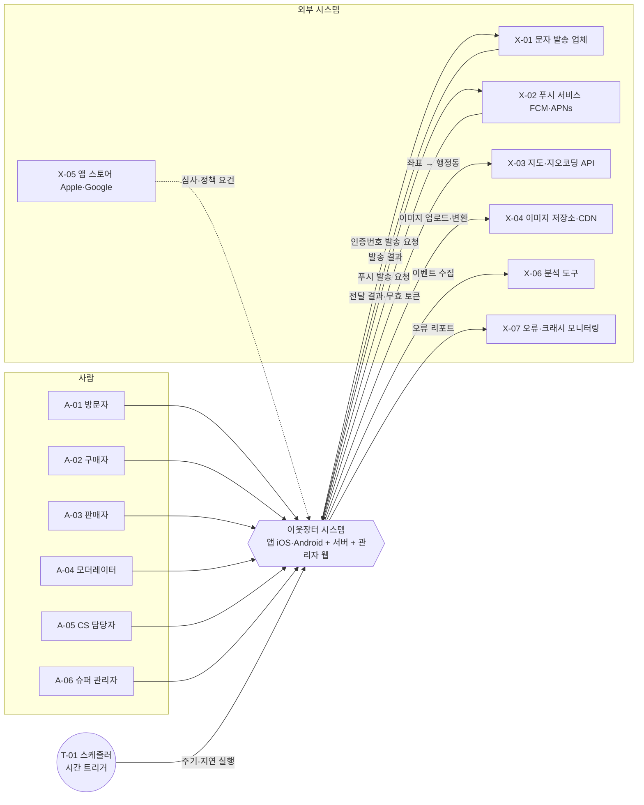

# 05. 액터 목록 (비사람) — 외부 시스템·시간 트리거

> **샘플 문서** · 가상 서비스 "이웃장터" 기준 · 작성일 2026-10-06 · v1.0 · 작성 PM(가상) · 상태 승인

| 구분 | 내용 |
|---|---|
| 단계 | 5 / 36 — B. 주체 |
| 입력 | 02(범위·제약), 03(기술 제약) |
| 산출물 | 외부 시스템·시간 액터 목록 + 컨텍스트 다이어그램 |
| 이 산출물이 쓰이는 곳 | 07(외부·시간 액터의 목표 도출) · 14(시간 액터 → 배치 기능) · 19(연동 기능 도출) · 23(결제사·스토어 정책 확인 대상) |

---

## 1. 컨텍스트 다이어그램

## 2. 외부 시스템 액터

| ID | 액터 | 선정 상태 | 방향 | 주고받는 정보 | 장애 시 영향 | 관련 제약·규제 |
|---|---|---|---|---|---|---|
| X-01 | 문자(SMS) 발송 업체 | 미정(DP-01) | 시스템→업체 요청, 업체→시스템 결과 | 수신 번호, 인증번호 문구 / 발송 성공·실패 | **가입·로그인 불가**(핵심 경로) | TC-01, RG-01 |
| X-02 | 푸시 알림 서비스(FCM·APNs) | 확정 | 시스템→서비스, 서비스→시스템 | 푸시 토큰, 알림 내용 / 전달 결과, 무효 토큰 | 알림 지연·미수신(채팅·약속 영향) | TC-03, TC-05, RG-14 |
| X-03 | 지도·지오코딩 API | 미정(DP-03) | 시스템→API | 좌표 / 행정동·지역명 | **동네 인증 불가**(글 등록·채팅 제한) | TC-02, RG-05 |
| X-04 | 이미지 저장소·CDN | 미정 | 앱·시스템→저장소 | 이미지 파일, 변환·서명 URL | 글·채팅 이미지 표시 불가 | TC-04 |
| X-05 | 앱 스토어(Apple App Store·Google Play) | 확정 | 스토어→시스템(요건) | 심사 기준, 정책 | 심사 반려 시 **출시 지연** | RG-10~RG-13, TC-07 |
| X-06 | 분석 도구 | 미정 | 앱→도구 | 사용 이벤트(비식별) | 지표 측정 불가(G 평가 영향) | RG-01(동의 연동) |
| X-07 | 오류·크래시 모니터링 | 미정 | 앱·서버→서비스 | 크래시·오류 로그 | 장애 탐지 지연 | — |

## 3. 시간 액터

| ID | 액터 | 설명 | 예시 동작(상세는 14번) |
|---|---|---|---|
| T-01 | 스케줄러(시간 트리거) | 정해진 주기 또는 지연 시점에 시스템이 스스로 실행하는 작업 주체 | 예약 자동 해제, 후기 리마인드, 약속 임박 알림, 탈퇴 유예 만료 파기, 제재 만료 해제, 임시 데이터 정리 |

## 4. 제외한 외부 액터 (사유)

| 항목 | 사유 |
|---|---|
| 결제 대행사(PG) | OUT-01(인앱 결제 없음) |
| 배송사 | OUT-02(택배 없음) |
| 광고 네트워크 | OUT-08(광고 없음) |
| 이메일 발송 서비스 | MVP는 앱 알림·푸시로 통지, 이메일 필요 시 재검토(관리자 문의 답변은 앱 내 노출) |
| 소셜 로그인 제공자 | AS-03(전화번호 인증 단일) |

## 5. 사람 액터와의 연결 (이후 단계에서 쓰임)

| 외부·시간 액터 | 주 사용 기능 영역(후보) | 상세 단계 |
|---|---|---|
| X-01 | 가입·인증 | 07, 09, 19 |
| X-02 | 알림 | 09, 16, 19 |
| X-03 | 동네 | 09, 19 |
| X-04 | 파일·글·채팅 이미지 | 09, 19, 22 |
| X-05 | 컴플라이언스(신고·차단·계정 삭제) | 23 |
| X-06 | 성장·측정 | 28 |
| X-07 | 운영·모니터링 | 19, 22 |
| T-01 | 거래·후기·계정·제재·정리 | 14 |

---

## 완료 기준 체크 (05)

- [x] 외부 시스템(인증·푸시·지도·저장소·스토어·분석·모니터링)을 모두 나열했다
- [x] 시간 트리거를 액터(T-01)로 정의했다
- [x] 컨텍스트 다이어그램에 모든 외부 연결이 그려져 있다
- [x] 제외한 외부 액터와 사유가 기록되어 있다
