# 09. 유저 플로우 (액터별 동선) + ❓ 목록

> **샘플 문서** · 가상 서비스 "이웃장터" 기준 · 작성일 2026-10-06 · v1.0 · 작성 PM(가상) · 상태 승인

| 구분 | 내용 |
|---|---|
| 단계 | 9 / 36 — C. 행동 |
| 입력 | 07(목표 목록), 08(공통/고유 판정) |
| 산출물 | 플로우 다이어그램 12개(FL-01~FL-12), **❓ 목록(Q-001~Q-130)**, 등장한 명사·상태·화면 |
| 이 산출물이 쓰이는 곳 | ❓ → 후보 풀(31에서 통합) · 명사 → 11 · 상태 → 13 · 화면 → 17 · 10(시나리오 점검 대상) · 35(워크스루의 원본) |

## 읽는 법

- 다이어그램은 Mermaid 문법입니다(GitHub 등 Mermaid를 지원하는 뷰어에서 그림으로 보입니다).
- `❓Q-nnn` 노드 = 그 지점에서 **정의가 필요한 기능 후보**입니다. 아래 표에 같은 ID로 설명이 있습니다.
- `FL-xx`로 다른 플로우를 가리키면 그 플로우로 이어집니다. `X-xx`, `T-01`은 05번의 외부·시간 액터입니다.
- **작성 규칙(막다른 길 방지):** ① 모든 노드에 들어오는/나가는 화살표가 있다 ② 모든 분기(예/아니오, 성공/실패)에 전 갈래를 그린다 ③ 공통 목표(08번)는 한 번만 그린다.
- "도메인 구분(잠정)"은 서비스 범용 기능(공통)인지 서비스 고유 기능인지의 잠정 태그이며, 20번에서 확정합니다.

---

## 0. 목표 → 플로우 매핑 (모든 목표 67개 처리)

| 목표 | 플로우 | 비고 |
|---|---|---|
| UG-001 | FL-01 | 첫 실행 소개 |
| UG-002 | FL-04 | |
| UG-003 | FL-01 | |
| UG-004 | FL-01 | |
| UG-005 | FL-02 | |
| UG-006 | FL-02 | 닉네임·사진 |
| UG-007 | FL-10 | |
| UG-008 | FL-05 | |
| UG-009 | FL-05 | |
| UG-010 | FL-06 | |
| UG-011 | FL-07 | |
| UG-012 | FL-07 | |
| UG-013 | FL-07 | |
| UG-014 | FL-08 | |
| UG-015 | FL-10 | |
| UG-016 | FL-10 | |
| UG-017 | FL-02 | 동네 변경 분기 |
| UG-018 | FL-01 | 번호 변경 분기. 내 정보 조회·수정은 12번(CRUD)에서 처리 |
| UG-019 | FL-09 | |
| UG-020 | FL-01 | 로그아웃 분기 |
| UG-021 | FL-11 | |
| UG-022 | FL-11 | |
| UG-023 | FL-06 | 노쇼 신고 |
| UG-024 | FL-01 | 로그인 유도 |
| UG-030 | FL-04 | |
| UG-031 | FL-04 | |
| UG-032 | FL-04 | |
| UG-033 | FL-05 | |
| UG-034 | FL-06 | 구매 내역 |
| UG-040 | FL-03 | |
| UG-041 | FL-03 | |
| UG-042 | FL-06 | |
| UG-043 | FL-06 | 판매 내역 |
| UG-050 | FL-08 | |
| UG-051 | FL-08 | |
| UG-052 | FL-08 | |
| UG-053 | FL-08 | |
| UG-054 | FL-08 | |
| UG-060 | FL-12 | |
| UG-061 | FL-12 | |
| UG-062 | FL-09 | CS 복구 도구 |
| UG-063 | FL-12 | |
| UG-070 | FL-12 | |
| UG-071 | FL-11 | |
| UG-072 | (생략) | 카테고리·금칙어·정책 값은 단순 입력/수정 화면이라 **플로우 대신 12번 CRUD 표와 26번 운영 업무로 처리** |
| UG-073 | (생략) | 지표 조회는 분기가 없는 단일 화면이라 17번 화면 정의로 처리 |
| UG-074 | FL-12 | 감사 로그 |
| UG-075 | FL-12 | |
| UG-080 | FL-01 | 문자 발송 연동 |
| UG-081 | FL-10 | 푸시 발송 연동 |
| UG-082 | FL-02 | 행정동 변환 연동 |
| UG-083 | FL-03 | 이미지 업로드 연동 |
| UG-084 | (생략) | 사용자 동선이 없는 심사 요건 → 23번(규제·정책)에서 처리 |
| UG-085 | (생략) | 내부 이벤트 수집 → 28번(성장·측정)에서 처리 |
| UG-086 | (생략) | 내부 오류 수집 → 19번(외부 연동)에서 처리 |
| UG-090 | FL-06 | 예약 자동 해제 |
| UG-091 | FL-06 | 후기 리마인드 |
| UG-092 | FL-05 | 약속 알림 |
| UG-093 | FL-09 | 탈퇴 유예 만료 파기 |
| UG-094 | FL-08 | 제재 자동 해제 |
| UG-095 | FL-03 | 임시저장·고아 파일 정리(미완료 가입 정리는 14번에서 상세화) |
| UG-096 | FL-06 | 후기 기한 만료 |
| UG-097 | FL-02 | 인증 유효기간 만료 |
| UG-098 | FL-08 | SLA 임박 경고 |
| UG-099 | FL-11 | 예약 게시·시행 |
| UG-100 | (생략) | 사용자 동선이 없는 정기 배치 → 14번(시간·주기)에서 처리 |
| UG-101 | FL-12 | 문의 자동 종결 |

생략 6건(UG-072, 073, 084, 085, 086, 100)은 모두 사유와 처리 단계가 기록되어 있다.

---

## FL-01. 가입·로그인·로그아웃 (UG-001, 003, 004, 018, 020, 024, 080)

**액터:** A-01 → A-02·A-03 / **연동:** X-01(문자 발송)

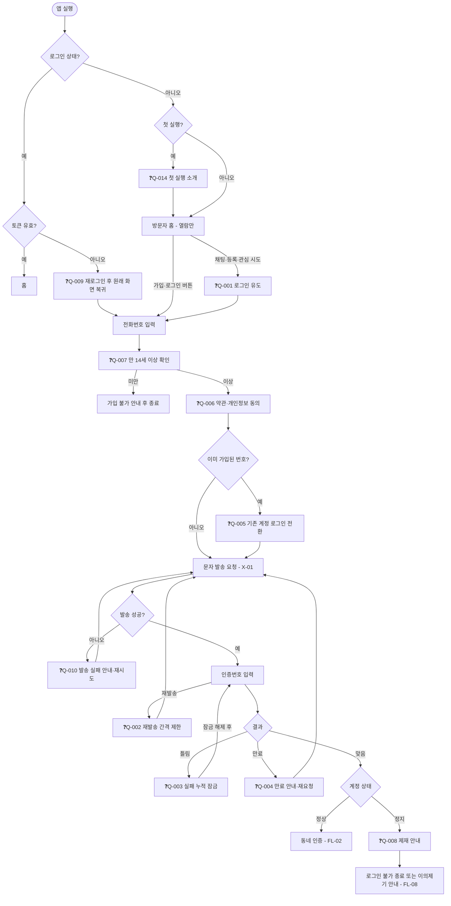

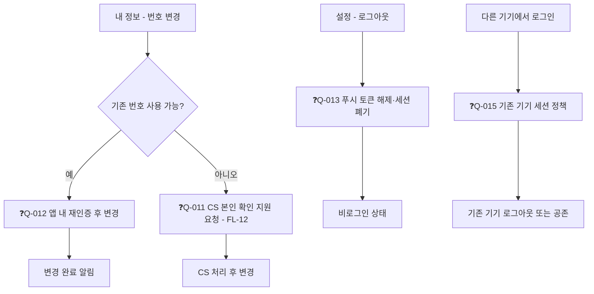

| ID | 위치 | ❓ 기능 후보 | 도메인 구분(잠정) |
|---|---|---|---|
| Q-001 | 채팅·등록·관심 시도 | 비로그인 상태에서 채팅·등록·관심을 시도하면 로그인 유도 화면을 보여주고, 가입 후 원래 화면으로 복귀 | 공통 |
| Q-002 | 인증번호 입력 | 인증번호 재발송(발송 간격 제한) | 공통 |
| Q-003 | 인증번호 틀림 | 입력 실패 누적 시 일정 시간 잠금과 안내 | 공통 |
| Q-004 | 인증번호 만료 | 유효시간 만료 안내와 재요청 | 공통 |
| Q-005 | 번호 중복 | 이미 가입된 번호로 가입 시도 시 기존 계정 로그인으로 전환 | 공통 |
| Q-006 | 약관 동의 | 약관·개인정보 수집·이용 동의 화면(필수/선택 분리, 동의 이력 저장) | 공통 |
| Q-007 | 연령 확인 | 만 14세 미만 가입 차단(연령 확인 단계) | 공통 |
| Q-008 | 계정 상태 | 이용 정지·영구 정지 계정의 가입·로그인 시 제재 안내 | 공통 |
| Q-009 | 토큰 만료 | 로그인 만료 시 재로그인 후 원래 화면 복귀 | 공통 |
| Q-010 | 발송 실패 | 문자 발송 실패 시 안내와 재시도(문자 업체 장애 포함) | 공통 |
| Q-011 | 번호 변경 | 기존 번호 사용 불가 시 CS를 통한 본인 확인 지원 경로 | 공통 |
| Q-012 | 번호 변경 | 기존 번호 사용 가능 시 앱 내 재인증 후 번호 변경 | 공통 |
| Q-013 | 로그아웃 | 로그아웃 시 푸시 토큰 해제와 세션 폐기 | 공통 |
| Q-014 | 첫 실행 | 첫 실행 소개 화면과 시작 버튼(비로그인 둘러보기 진입) | 공통 |
| Q-015 | 다른 기기 로그인 | 기기별 로그인 세션 정책과 관리 | 공통 |

---

## FL-02. 동네 인증·변경·프로필 (UG-005, 006, 017, 082, 097)

**액터:** A-02·A-03(공통) / **연동:** X-03(지오코딩) / **시간:** T-01(유효기간)

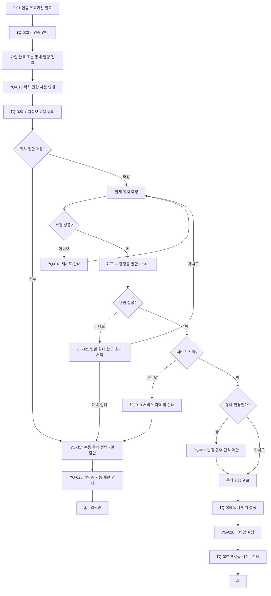

| ID | 위치 | ❓ 기능 후보 | 도메인 구분(잠정) |
|---|---|---|---|
| Q-016 | 권한 요청 전 | 위치 권한 요청 전 목적 설명(사전 안내) | 공통 |
| Q-017 | 권한 거부 | 위치 권한 거부 시 수동 동네 선택(열람만 가능, 인증 미완료 표시) | 고유 |
| Q-018 | 위치 측정 | 측정 실패·정확도 낮음 시 재시도·안내 | 고유 |
| Q-019 | 서비스 지역 | 서비스 지역 밖일 때 안내 | 고유 |
| Q-020 | 동의 | 위치정보 이용 동의(별도) | 공통 |
| Q-021 | 행정동 변환 | 변환 실패·외부 API 한도 초과 시 처리 | 고유 |
| Q-022 | 동네 변경 | 변경 횟수·간격 제한과 재인증 | 고유 |
| Q-023 | 유효기간 | 동네 인증 유효기간 만료 시 재인증 안내 | 고유 |
| Q-024 | 동네 범위 | 인접 동네 포함 범위(단계) 설정 | 고유 |
| Q-025 | 미인증 상태 | 동네 미인증 시 글 등록·채팅 제한과 사유 안내 | 고유 |
| Q-026 | 프로필 | 닉네임 설정(중복·금칙어 검사) | 고유 |
| Q-027 | 프로필 | 프로필 사진 설정(선택, 기본 이미지) | 고유 |

---

## FL-03. 글 등록·수정·삭제 (UG-040, 041, 083, 095)

**액터:** A-03 / **연동:** X-04(이미지) / **시간:** T-01(임시저장·고아 파일 정리)

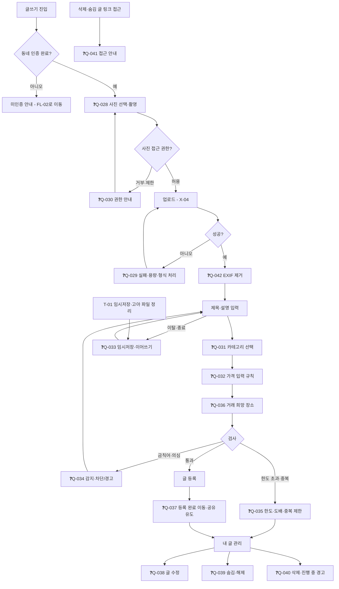

| ID | 위치 | ❓ 기능 후보 | 도메인 구분(잠정) |
|---|---|---|---|
| Q-028 | 사진 선택 | 사진 선택·촬영(최대 장수, 순서 변경, 대표 사진 지정) | 고유 |
| Q-029 | 업로드 | 업로드 실패·용량 초과·형식 오류 처리 | 공통 |
| Q-030 | 권한 | 사진 접근 권한 거부·제한 시 안내 | 공통 |
| Q-031 | 입력 | 카테고리 선택(필수) | 고유 |
| Q-032 | 입력 | 가격 입력 규칙(나눔 0원, 상한, 숫자 검증) | 고유 |
| Q-033 | 이탈 | 임시저장·이어쓰기(앱 종료·네트워크 끊김 포함) | 고유 |
| Q-034 | 검사 | 금칙어·금지 품목·사기 의심 문구 감지와 등록 차단/경고 | 고유 |
| Q-035 | 검사 | 등록 한도·도배·중복 글 제한 | 고유 |
| Q-036 | 입력 | 거래 희망 장소(동네 내 대략 위치) 입력 | 고유 |
| Q-037 | 등록 후 | 등록 완료 후 상세 이동과 공유 유도 | 고유 |
| Q-038 | 관리 | 글 수정(상태별 수정 가능 범위, 사진 추가·삭제) | 고유 |
| Q-039 | 관리 | 글 숨김·숨김 해제 | 고유 |
| Q-040 | 관리 | 글 삭제(진행 중 채팅·예약이 있을 때 경고) | 고유 |
| Q-041 | 링크 접근 | 삭제·숨김 글 링크 접근 시 안내 화면 | 고유 |
| Q-042 | 업로드 후 | 이미지 EXIF(위치 등) 메타데이터 제거 | 공통 |

---

## FL-04. 탐색·관심 (UG-002, 030, 031, 032)

**액터:** A-01(열람만), A-02

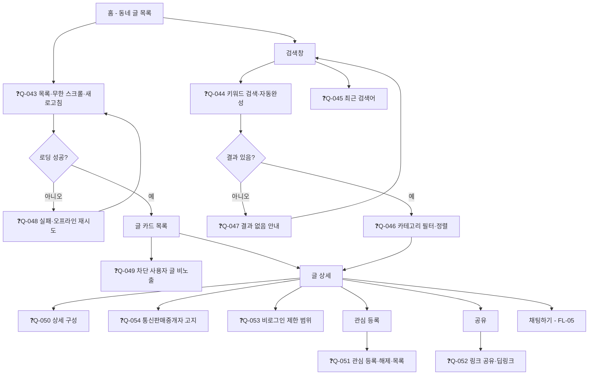

| ID | 위치 | ❓ 기능 후보 | 도메인 구분(잠정) |
|---|---|---|---|
| Q-043 | 홈 | 동네 기반 글 목록(최신순, 무한 스크롤, 당겨서 새로고침) | 고유 |
| Q-044 | 검색 | 키워드 검색(자동완성) | 고유 |
| Q-045 | 검색 | 최근 검색어 저장·개별/전체 삭제 | 고유 |
| Q-046 | 결과 | 카테고리 필터·정렬(최신/가격) | 고유 |
| Q-047 | 결과 | 검색 결과 없음 안내와 다른 카테고리·동네 제안 | 고유 |
| Q-048 | 로딩 | 목록 로딩 실패·오프라인 시 재시도 화면 | 공통 |
| Q-049 | 목록 | 차단한 사용자의 글 비노출 | 고유 |
| Q-050 | 글 상세 | 사진 슬라이드, 판매자 매너·후기 요약, 조회·관심·채팅 수 | 고유 |
| Q-051 | 관심 | 관심 글 등록·해제·목록 | 고유 |
| Q-052 | 공유 | 글 링크 공유와 딥링크(앱 미설치 시 스토어 이동) | 공통 |
| Q-053 | 비로그인 | 비로그인 둘러보기에서 열람 가능한 범위 정의 | 고유 |
| Q-054 | 글 상세 | 통신판매중개자 고지 문구 노출 | 공통 |

---

## FL-05. 채팅·약속 (UG-008, 009, 033, 092)

**액터:** A-02·A-03(공통) / **시간:** T-01(약속 알림)

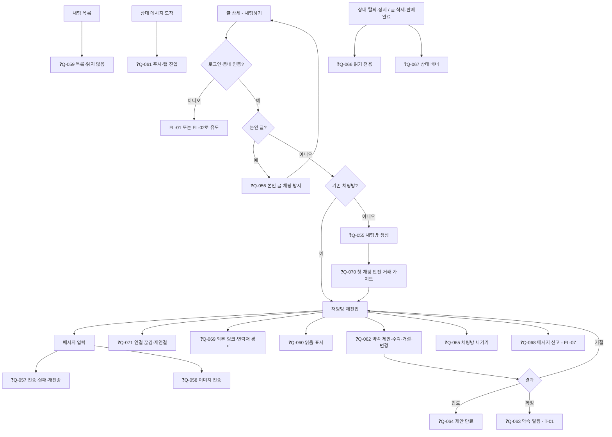

| ID | 위치 | ❓ 기능 후보 | 도메인 구분(잠정) |
|---|---|---|---|
| Q-055 | 채팅 시작 | 글 기준 1:1 채팅방 생성과 기존 방 재진입 | 고유 |
| Q-056 | 채팅 시작 | 본인 글에 채팅 시작 방지 | 고유 |
| Q-057 | 메시지 | 텍스트 전송·전송 실패·재전송 | 고유 |
| Q-058 | 메시지 | 이미지 메시지 전송(개수·용량 제한, 업로드 실패 처리) | 고유 |
| Q-059 | 목록 | 채팅방 목록(마지막 메시지, 읽지 않음 표시) | 고유 |
| Q-060 | 메시지 | 메시지 읽음 표시 | 고유 |
| Q-061 | 알림 | 채팅 푸시(앱 종료 상태 포함)와 알림 탭 시 채팅방 진입 | 고유 |
| Q-062 | 약속 | 약속 제안(시간·장소)·수락·거절·변경 | 고유 |
| Q-063 | 약속 | 약속 알림(전일·1시간 전) | 고유 |
| Q-064 | 약속 | 약속 제안 만료 처리 | 고유 |
| Q-065 | 채팅방 | 채팅방 나가기(상대에게 안내) | 고유 |
| Q-066 | 채팅방 | 상대가 탈퇴·정지된 채팅방의 읽기 전용 처리 | 고유 |
| Q-067 | 채팅방 | 글이 삭제·판매완료된 채팅방의 상태 배너 | 고유 |
| Q-068 | 메시지 | 메시지 신고 | 공통 |
| Q-069 | 메시지 | 채팅 중 외부 링크·연락처 노출 경고(사기 방지) | 고유 |
| Q-070 | 첫 채팅 | 첫 채팅 시 안전 거래 가이드 노출 | 고유 |
| Q-071 | 연결 | 연결 끊김 표시와 재연결 | 고유 |

---

## FL-06. 거래 상태·후기·내역 (UG-010, 023, 034, 042, 043, 090, 091, 096)

**액터:** A-02·A-03 / **시간:** T-01(예약 자동 해제, 후기 리마인드·만료)

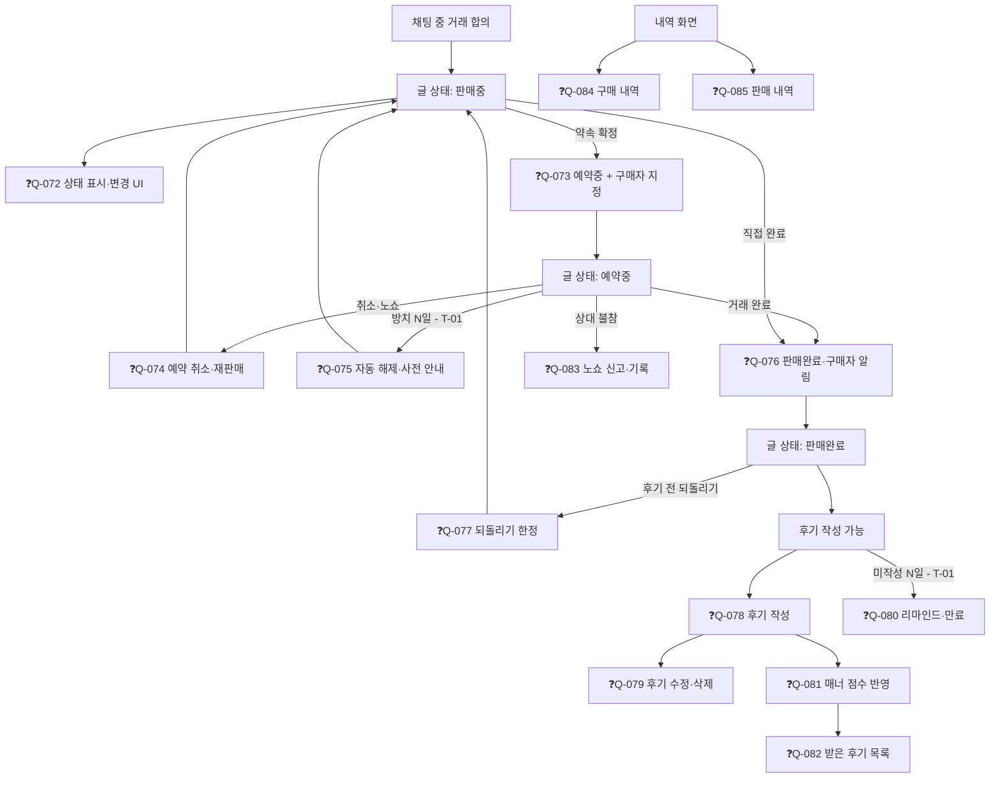

| ID | 위치 | ❓ 기능 후보 | 도메인 구분(잠정) |
|---|---|---|---|
| Q-072 | 글 상태 | 글 상태(판매중/예약중/판매완료) 표시와 변경 UI | 고유 |
| Q-073 | 예약중 | 예약중 설정 시 구매자(채팅 상대) 지정 | 고유 |
| Q-074 | 예약 취소 | 예약 취소와 재판매(판매중 복귀) | 고유 |
| Q-075 | 방치 | 예약 방치 시 자동 해제와 사전 안내 | 고유 |
| Q-076 | 판매완료 | 판매완료 처리와 구매자 알림 | 고유 |
| Q-077 | 되돌리기 | 판매완료 되돌리기(후기 작성 전에 한정) | 고유 |
| Q-078 | 후기 | 후기 작성(양방향, 점수·태그·한 줄, 작성 가능 기간) | 고유 |
| Q-079 | 후기 | 후기 수정·삭제 | 고유 |
| Q-080 | 후기 | 후기 미작성 리마인드와 기간 만료 처리 | 고유 |
| Q-081 | 매너 | 매너 점수 산출과 프로필 표시 | 고유 |
| Q-082 | 후기 | 받은 후기 목록 | 고유 |
| Q-083 | 노쇼 | 노쇼 신고와 기록 | 고유 |
| Q-084 | 내역 | 내 구매 내역 | 고유 |
| Q-085 | 내역 | 내 판매 내역(상태별 보기) | 고유 |

---

## FL-07. 신고·차단·문의 (UG-011, 012, 013)

**액터:** A-02·A-03(공통)

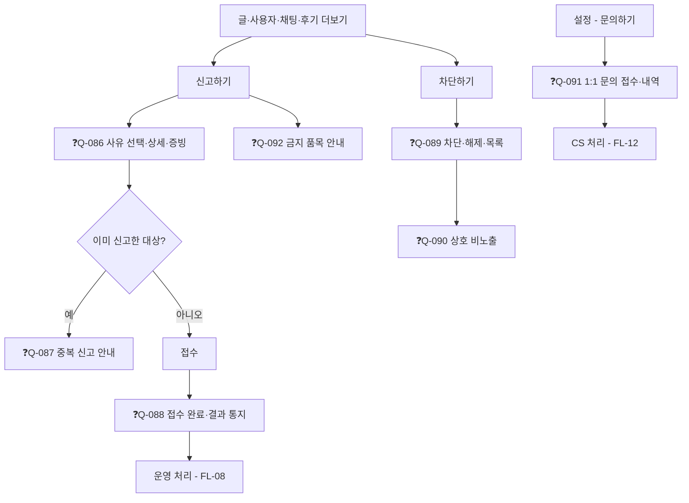

| ID | 위치 | ❓ 기능 후보 | 도메인 구분(잠정) |
|---|---|---|---|
| Q-086 | 신고 | 신고 접수 화면(대상 유형별 사유 선택, 상세 입력, 증빙 첨부) | 공통 |
| Q-087 | 신고 | 동일 대상 중복 신고 방지·안내 | 공통 |
| Q-088 | 신고 | 접수 완료 안내와 처리 결과 통지 | 공통 |
| Q-089 | 차단 | 사용자 차단·차단 해제·차단 목록 | 고유 |
| Q-090 | 차단 | 차단 시 상호 비노출(글·채팅·프로필) | 고유 |
| Q-091 | 문의 | 1:1 문의 접수(유형 선택, 첨부)와 내역·답변 확인 | 공통 |
| Q-092 | 신고 | 금지 품목 안내 링크(신고 사유 설명) | 고유 |

---

## FL-08. 신고 운영 처리·이의제기 (UG-014, 050~054, 094, 098)

**액터:** A-04(모더레이터), 사용자 / **시간:** T-01(SLA 경고, 제재 만료)

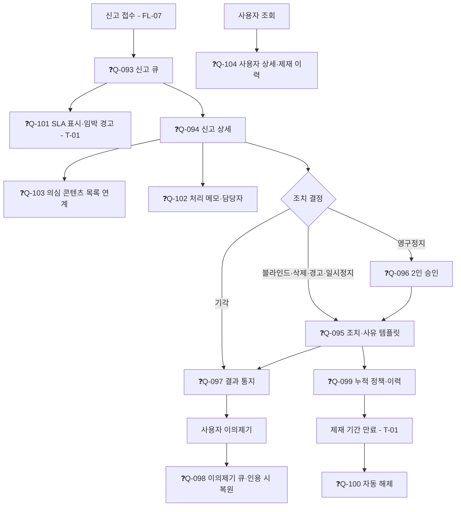

| ID | 위치 | ❓ 기능 후보 | 도메인 구분(잠정) |
|---|---|---|---|
| Q-093 | 큐 | 신고 큐(상태·유형 필터, 정렬) | 고유 |
| Q-094 | 상세 | 신고 상세(대상 콘텐츠, 신고자·피신고자 이력, 증빙 확인) | 고유 |
| Q-095 | 조치 | 조치 선택(블라인드·삭제·경고·일시정지·영구정지)과 사유 템플릿 | 고유 |
| Q-096 | 조치 | 영구정지 2인 승인 | 고유 |
| Q-097 | 통지 | 조치 결과 통지(피신고자·신고자) | 고유 |
| Q-098 | 이의제기 | 이의제기 접수(사용자)·처리 큐(운영자)·인용 시 콘텐츠·제재 복원 | 고유 |
| Q-099 | 제재 | 제재 누적 정책(경고 N회 → 정지)과 이력 | 고유 |
| Q-100 | 제재 | 제재 기간 만료 시 자동 해제 | 고유 |
| Q-101 | 큐 | 신고 처리 기한(SLA) 표시와 임박 경고 | 고유 |
| Q-102 | 상세 | 처리 메모(내부 코멘트)와 담당자 지정 | 고유 |
| Q-103 | 모니터링 | 의심 콘텐츠 목록(금칙어 적중, 신고 급증) | 고유 |
| Q-104 | 사용자 | 사용자 조회·상세(제재 이력, 최근 활동) | 고유 |

---

## FL-09. 탈퇴·복구 (UG-019, 062, 093)

**액터:** A-02·A-03, A-05(복구 지원) / **시간:** T-01(유예 만료 파기)

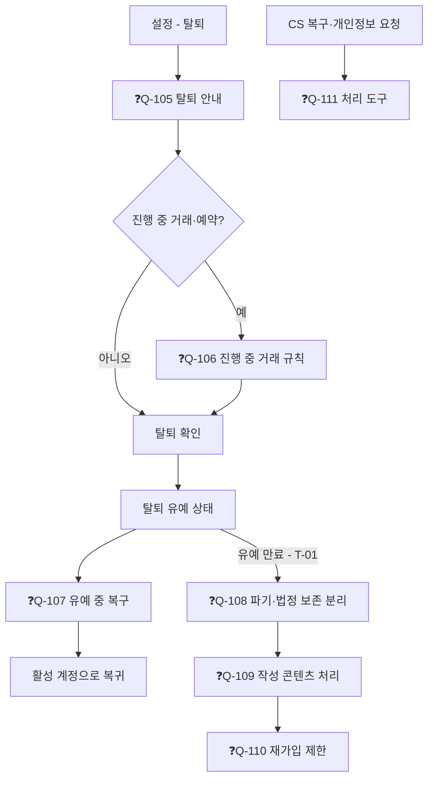

| ID | 위치 | ❓ 기능 후보 | 도메인 구분(잠정) |
|---|---|---|---|
| Q-105 | 탈퇴 | 탈퇴 안내(삭제·보존 항목, 진행 중 거래, 복구 가능 기간) | 공통 |
| Q-106 | 탈퇴 | 진행 중 거래(예약중 글·약속)가 있을 때의 탈퇴 처리 규칙 | 고유 |
| Q-107 | 유예 | 탈퇴 유예 상태와 재로그인 시 복구 선택 | 공통 |
| Q-108 | 파기 | 유예 만료 후 개인정보 파기와 법정 보존 정보 분리 | 공통 |
| Q-109 | 파기 | 탈퇴 후 작성 콘텐츠(글·후기·채팅) 처리 방침 | 고유 |
| Q-110 | 재가입 | 재가입 제한(제재 회피 방지, 일정 기간) | 공통 |
| Q-111 | CS | CS를 통한 탈퇴 복구·개인정보 열람·삭제 요청 처리 도구 | 공통 |

---

## FL-10. 알림 (UG-007, 015, 016, 081)

**액터:** A-02·A-03 / **연동:** X-02(푸시)

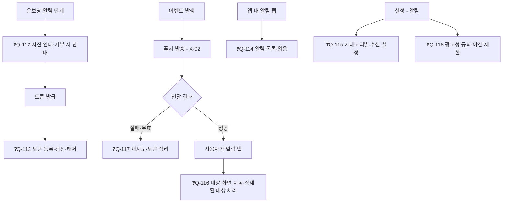

| ID | 위치 | ❓ 기능 후보 | 도메인 구분(잠정) |
|---|---|---|---|
| Q-112 | 권한 | 푸시 권한 요청 전 사전 안내와 거부 시 설정 이동 안내 | 공통 |
| Q-113 | 토큰 | 푸시 토큰 등록·갱신·해제 | 공통 |
| Q-114 | 인앱 | 알림 목록(인앱), 읽음 처리, 일괄 읽음·삭제 | 공통 |
| Q-115 | 설정 | 알림 카테고리별 수신 설정 | 공통 |
| Q-116 | 탭 | 알림 탭 시 대상 화면 이동(딥링크), 삭제된 대상 처리 | 공통 |
| Q-117 | 발송 | 푸시 발송 실패·무효 토큰 정리 | 공통 |
| Q-118 | 설정 | 광고성 알림 수신 동의·철회와 야간 전송 제한 | 공통 |

---

## FL-11. 약관·공지·FAQ (UG-021, 022, 071, 099)

**액터:** A-01·A-02·A-03, A-06 / **시간:** T-01(예약 게시·시행)

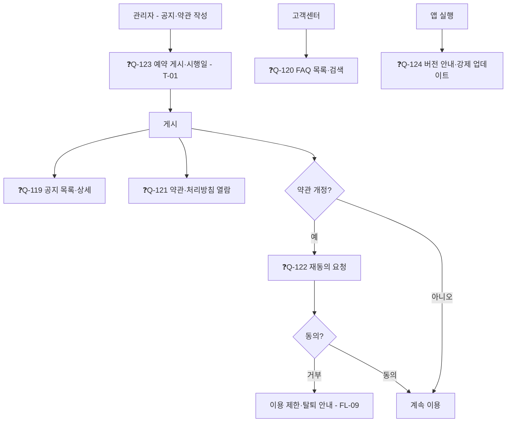

| ID | 위치 | ❓ 기능 후보 | 도메인 구분(잠정) |
|---|---|---|---|
| Q-119 | 공지 | 공지 목록·상세(비로그인 열람 포함) | 공통 |
| Q-120 | FAQ | FAQ 목록·검색 | 공통 |
| Q-121 | 약관 | 이용약관·개인정보 처리방침 열람(이전 버전 포함) | 공통 |
| Q-122 | 개정 | 개정 약관 재동의 요청과 거부 시 이용 제한 정책 | 공통 |
| Q-123 | 관리자 | 공지·약관 예약 게시와 시행일 처리 | 공통 |
| Q-124 | 앱 실행 | 앱 버전 안내와 강제 업데이트 | 공통 |

---

## FL-12. 관리자 로그인·계정 지원·문의 (UG-060, 061, 063, 070, 074, 075, 101)

**액터:** A-04·A-05·A-06 / **시간:** T-01(문의 자동 종결)

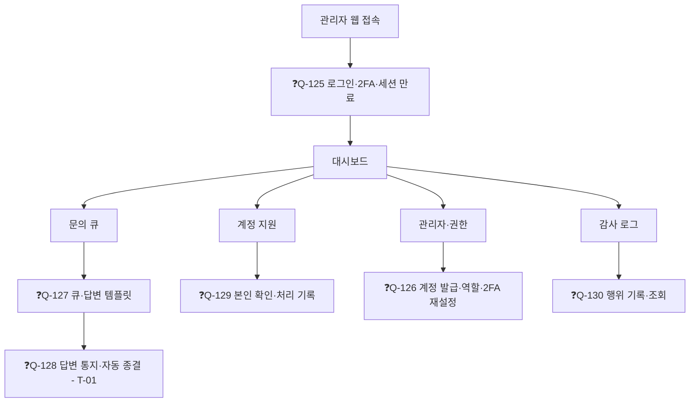

| ID | 위치 | ❓ 기능 후보 | 도메인 구분(잠정) |
|---|---|---|---|
| Q-125 | 로그인 | 관리자 로그인(아이디·비밀번호·2FA)과 세션 만료 | 공통 |
| Q-126 | 계정 | 관리자 계정 발급·역할 부여·비활성화·2FA 재설정 | 공통 |
| Q-127 | 문의 | 문의 큐(상태·유형 필터)와 답변 템플릿 | 공통 |
| Q-128 | 문의 | 문의 답변 통지와 일정 기간 후 자동 종결 | 공통 |
| Q-129 | 계정 지원 | 번호 변경 등 계정 지원 시 본인 확인 절차와 처리 기록 | 공통 |
| Q-130 | 감사 | 관리자 행위 감사 로그 기록·조회 | 공통 |

---

## 플로우 점검 결과 (규칙 적용)

| 플로우 | 진입점 | 이탈점 | 분기 갈래 완결 | 막다른 길 | 비고 |
|---|---|---|---|---|---|
| FL-01 | 앱 실행 | 홈·동네 인증·종료 | ✓ | 없음 | 정지 계정은 이의제기 안내로 연결 |
| FL-02 | 가입 완료·동네 변경 | 홈 | ✓ | 없음 | 수동 선택 경로는 열람만 가능 |
| FL-03 | 글쓰기 | 내 글 관리 | ✓ | 없음 | |
| FL-04 | 홈·검색 | 글 상세·채팅 | ✓ | 없음 | |
| FL-05 | 글 상세 | 채팅방 | ✓ | 없음 | |
| FL-06 | 채팅 합의 | 후기·내역 | ✓ | 없음 | |
| FL-07 | 더보기·설정 | 운영 처리·CS | ✓ | 없음 | |
| FL-08 | 신고 접수 | 결과 통지·만료 해제 | ✓ | 없음 | |
| FL-09 | 설정 | 활성 복귀·파기 | ✓ | 없음 | |
| FL-10 | 온보딩·이벤트 | 대상 화면 | ✓ | 없음 | |
| FL-11 | 관리자 작성·앱 실행 | 계속 이용·탈퇴 안내 | ✓ | 없음 | |
| FL-12 | 관리자 접속 | 각 업무 | ✓ | 없음 | |

---

## 이 단계의 부산물

| 구분 | 내용 | 전달 단계 |
|---|---|---|
| 명사(→ 엔티티) | 사용자, 동네 인증, 글, 이미지, 관심, 채팅방, 메시지, 약속, 거래, 후기, 신고, 제재, 차단, 알림, 푸시 토큰, 문의, 동의 이력, 공지·FAQ, 카테고리, 관리자 계정, 감사 로그, 금칙어, 이의제기 | 11 |
| 상태 | 글(판매중·예약중·판매완료·숨김·삭제·블라인드), 계정(활성·정지·탈퇴 유예), 약속, 신고, 제재, 후기, 채팅방 | 13 |
| 화면 | 홈, 검색, 글 상세, 글쓰기, 채팅방, 신고 시트, 설정, 관리자 큐 등 | 17 |
| 후보 | Q-001 ~ Q-130 (130건) | 31(통합) |

---

## 완료 기준 체크 (09)

- [x] 07번 목표 67개가 모두 플로우에 매핑되거나 생략 사유가 기록되어 있다
- [x] 모든 플로우에서 막다른 길이 없고 모든 분기의 전 갈래가 그려져 있다
- [x] 공통 목표(08번)는 한 번만 그렸다
- [x] ❓ 130건이 ID로 목록화되어 있다
- [x] 명사·상태·화면이 후속 단계로 전달되었다
