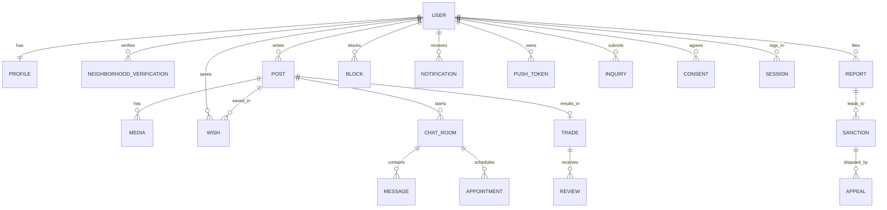

# 11. 엔티티 목록과 용어집

> **샘플 문서** · 가상 서비스 "이웃장터" 기준 · 작성일 2026-10-06 · v1.0 · 작성 PM(가상) · 상태 승인

| 구분 | 내용 |
|---|---|
| 단계 | 11 / 36 — D. 대상 |
| 입력 | 09·10(플로우의 명사) |
| 산출물 | 엔티티 목록(E-01~E-27) + 용어집 |
| 이 산출물이 쓰이는 곳 | 12·13·15·16·25(표의 행) · 21(영역 구성 기준) · 31(용어 통일) |

---

## 1. 엔티티 목록

| ID | 엔티티 | 설명 | 핵심 속성(요약) | 주 소유 액터 | 관련 플로우 | 개인정보 |
|---|---|---|---|---|---|---|
| E-01 | 사용자(User) | 가입한 계정 | 전화번호(암호화), 상태, 가입일, 연령 확인, 현재 동의 버전 | 본인 | FL-01, 09 | ● 전화번호 |
| E-02 | 프로필(Profile) | 공개되는 사용자 정보 | 닉네임, 사진, 소개, 매너 점수 | 본인 | FL-02 | ● 닉네임·사진 |
| E-03 | 동네 인증(NeighborhoodVerification) | 사용자의 인증된 동네 | 행정동 코드, 인증 일시, 유효기간, 범위 단계 | 본인 | FL-02 | ● 위치(행정동 단위) |
| E-04 | 글(Post) | 판매 글 | 제목, 설명, 가격, 카테고리, 상태, 거래 희망 장소, 작성자 | A-03 | FL-03, 04 | |
| E-05 | 이미지(Media) | 업로드된 이미지 | 파일 키, 용도(글·채팅·프로필·증빙), 소유자, 처리 상태 | 업로더 | FL-03, 05 | ● 촬영 정보(EXIF 제거 대상) |
| E-06 | 관심(Wish) | 관심 글 저장 | 사용자, 글 | A-02 | FL-04 | |
| E-07 | 채팅방(ChatRoom) | 글 기준 1:1 대화방 | 글, 구매자, 판매자, 상태 | 참여자 | FL-05 | |
| E-08 | 메시지(Message) | 채팅 내용 | 채팅방, 발신자, 유형(텍스트·이미지·시스템), 읽음 | 발신자 | FL-05 | ● 대화 내용 |
| E-09 | 약속(Appointment) | 거래 시간·장소 합의 | 채팅방, 제안자, 일시, 장소, 상태 | 참여자 | FL-05 | |
| E-10 | 거래(Trade) | 글과 구매자의 거래 기록 | 글, 판매자, 구매자, 상태, 완료일 | 판매자 | FL-06 | |
| E-11 | 후기(Review) | 거래 후 평가 | 거래, 작성자, 대상, 점수·태그·한 줄, 상태 | 작성자 | FL-06 | |
| E-12 | 신고(Report) | 부적절 대상 신고 | 신고자, 대상 유형·ID, 사유, 증빙, 상태, 담당자 | 신고자·A-04 | FL-07, 08 | |
| E-13 | 제재(Sanction) | 사용자·콘텐츠 조치 | 대상 사용자, 유형, 기간, 사유, 상태, 근거 신고 | A-04 | FL-08 | |
| E-14 | 이의제기(Appeal) | 조치에 대한 이의 | 제재 또는 조치, 내용, 상태, 처리자 | 제기자 | FL-08 | |
| E-15 | 차단(Block) | 사용자 간 차단 관계 | 차단자, 대상 | 차단자 | FL-07 | |
| E-16 | 알림(Notification) | 인앱 알림 | 수신자, 유형, 내용, 대상 참조, 읽음 | 수신자 | FL-10 | |
| E-17 | 푸시 토큰(PushToken) | 기기 푸시 주소 | 사용자, 기기, 토큰, 마지막 사용 | 시스템 | FL-10 | ● 기기 식별자 |
| E-18 | 문의(Inquiry) | 1:1 문의 | 사용자, 유형, 내용, 첨부, 상태, 답변 | 작성자 | FL-07, 12 | ● 문의 내용 |
| E-19 | 동의 이력(Consent) | 약관 동의 기록 | 사용자, 약관 종류, 버전, 동의 여부, 일시 | 시스템 | FL-01, 11 | ● |
| E-20 | 공지·FAQ·약관 문서(Notice) | 게시 문서 | 유형, 제목, 본문, 버전, 게시일, 시행일 | A-06 | FL-11 | |
| E-21 | 카테고리(Category) | 글 분류 | 이름, 순서, 활성 | A-06 | FL-03, 04 | |
| E-22 | 금칙어(BannedWord) | 감지 사전 | 단어·패턴, 유형(금칙·금지품목·사기 의심), 조치(차단·경고) | A-06 | FL-03, 05 | |
| E-23 | 관리자 계정(AdminAccount) | 운영자 로그인 계정 | 아이디, 역할, 2FA, 상태 | A-06 | FL-12 | ● |
| E-24 | 감사 로그(AuditLog) | 관리자 행위 기록 | 행위자, 행위, 대상, 사유, 시각 | 시스템 | FL-12 | ● |
| E-25 | 세션·기기(Session) | 로그인 세션 | 사용자, 기기, 토큰, 만료 | 시스템 | FL-01 | ● 기기 정보 |
| E-26 | 인증번호 요청(OtpRequest) | 문자 인증 시도 | 번호(해시), 발급·만료 시각, 실패 횟수, 상태 | 시스템 | FL-01 | ● |
| E-27 | 설정값(Config) | 정책 값·점검·버전 | 키, 값, 변경 이력 | A-06 | FL-11, 12 | |

## 2. 엔티티 관계 (요약)

## 3. 용어집

| 표준 용어 | 정의 | 사용하지 않는 동의어 |
|---|---|---|
| 글 | 판매자가 올리는 판매 게시물(엔티티 Post) | 상품, 게시물, 아이템 |
| 동네 인증 | 현재 위치로 행정동을 확인해 사용자의 동네로 기록하는 절차 | 위치 인증, 지역 인증 |
| 판매중 / 예약중 / 판매완료 | 글의 거래 상태 3가지 | 거래중, 완료, 마감 |
| 약속 | 채팅방 안에서 합의한 거래 시간·장소 | 일정, 미팅 |
| 후기 | 거래 후 서로에게 남기는 평가 | 리뷰, 평점(점수는 후기 속성) |
| 매너 점수 | 후기 등으로 산출되는 사용자 신뢰 수치 | 신뢰 지수, 온도 |
| 신고 | 부적절 대상을 운영팀에 알리는 행위 | 제보 |
| 제재 | 운영자가 사용자·콘텐츠에 부과하는 조치(경고·일시정지·영구정지) | 처벌, 징계 |
| 블라인드 | 운영 조치로 글을 숨김 처리한 상태 | 가림 |
| 숨김 | 판매자가 스스로 글을 비공개로 전환한 상태 | 비공개 |
| 탈퇴 유예 | 탈퇴 신청 후 복구 가능한 기간의 계정 상태 | 휴면(휴면은 별개 개념, 이번 범위 아님) |
| 운영 액터 | A-04~A-06 관리자 웹 사용자 | 어드민 유저 |

---

## 완료 기준 체크 (11)

- [x] 09번 플로우의 모든 명사가 엔티티로 정리되었다 (명사 → E-01~E-27)
- [x] 엔티티마다 설명·핵심 속성·소유 액터·개인정보 여부가 있다
- [x] 용어집에 표준 용어와 금지 동의어가 있다
