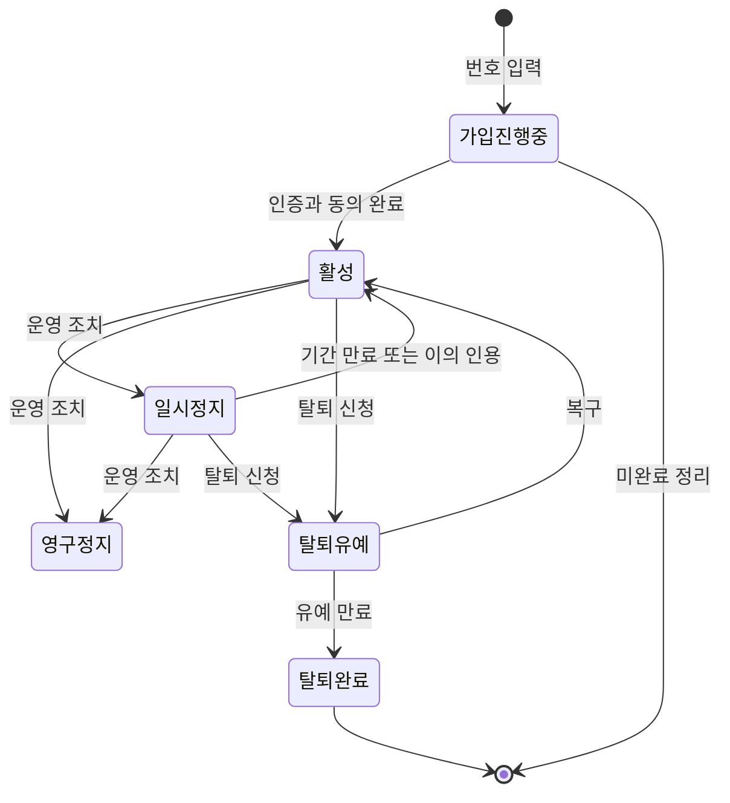
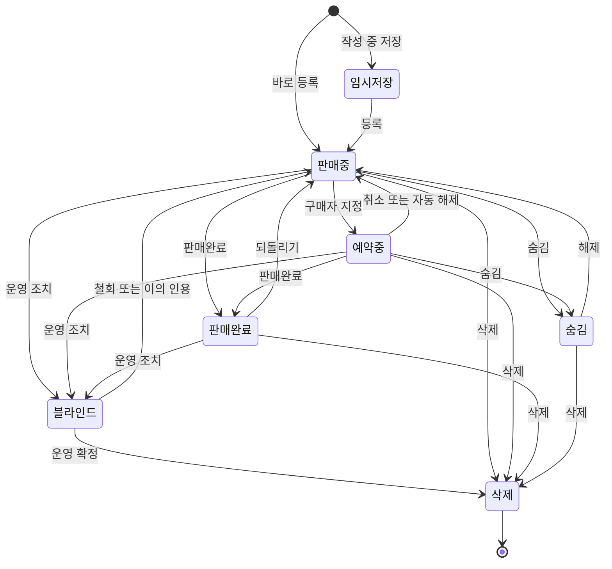
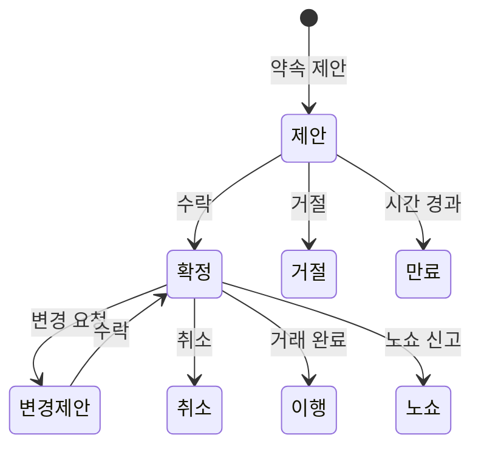
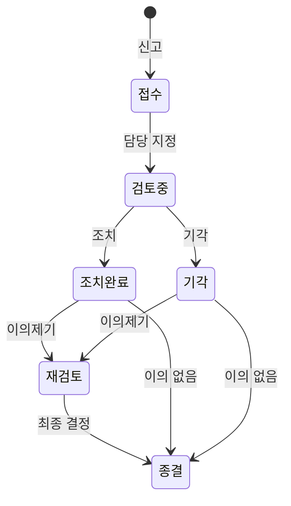
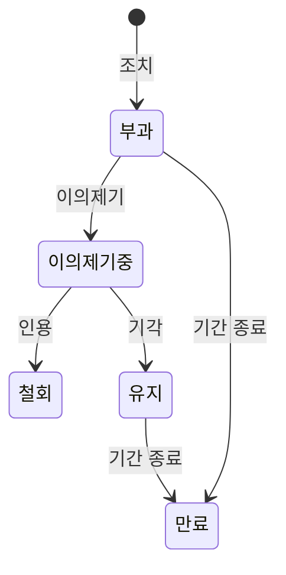
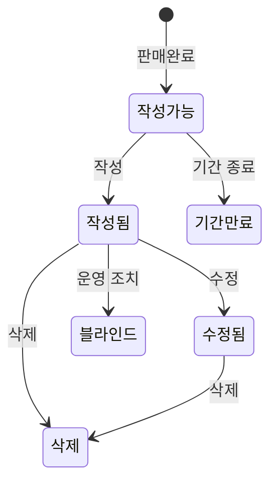

# 13. 상태·전이

> **샘플 문서** · 가상 서비스 "이웃장터" 기준 · 작성일 2026-10-06 · v1.0 · 작성 PM(가상) · 상태 승인

| 구분 | 내용 |
|---|---|
| 단계 | 13 / 36 — D. 대상 |
| 입력 | 09(플로우), 11(엔티티) |
| 산출물 | 엔티티별 상태도, 전이 트리거 목록(사용자/시스템/시간/운영) |
| 이 산출물이 쓰이는 곳 | 트리거 없는 전이 → 후보 풀 · 14(시간 트리거 전달) · 16(상태 변경 = 이벤트) · 26(운영 처리 흐름) · 34(전이→기능 검사) |

> **규칙:** 모든 전이에는 트리거(누가·언제)와 담당 기능(후보 ID)이 있어야 합니다. 정책 값(기간·횟수)은 22번의 원격 설정 대상이며 아래 숫자는 샘플 예시입니다.

---

## 1. 상태도

### 1-1. 사용자 (E-01)

### 1-2. 글 (E-04)

### 1-3. 약속 (E-09)

### 1-4. 신고·제재·이의제기 (E-12, E-13, E-14)

### 1-5. 후기 (E-11)

### 1-6. 그 외 (표로만 정의)

채팅방(E-07: 활성 → 읽기전용 → 보관 / 나감), 문의(E-18: 접수 → 처리중 → 답변완료 → 종결), 인증번호 요청(E-26: 발급 → 검증성공 / 만료 / 잠금)은 아래 전이표로 정의합니다.

---

## 2. 전이표

**트리거 유형:** 사용자 · 시스템 · 시간(T-01 또는 TTL) · 운영(A-04~A-06)

| ID | 엔티티 | 시작 상태 | 종료 상태 | 트리거 유형 | 트리거 주체 | 조건(가드) | 담당 후보 |
|---|---|---|---|---|---|---|---|
| TR-01 | 사용자 | (없음) | 가입진행중 | 사용자 | A-01 | 연령 확인 통과 | Q-007, Q-002 |
| TR-02 | 사용자 | 가입진행중 | 활성 | 사용자 | A-01 | 인증 성공 + 필수 동의 | Q-006 |
| TR-03 | 사용자 | 가입진행중 | (폐기) | 시간 | T-01 | 미완료 N시간 경과 | CF-13-01 |
| TR-04 | 사용자 | 활성 | 일시정지 | 운영 | A-04 | 제재 유형이 일시정지 | Q-095 |
| TR-05 | 사용자 | 일시정지 | 활성 | 시간 | T-01 | 정지 기간 종료 | Q-100 |
| TR-06 | 사용자 | 일시정지 | 활성 | 운영 | A-04 | 이의제기 인용 | Q-098 |
| TR-07 | 사용자 | 활성·일시정지 | 영구정지 | 운영 | A-04 + 2인 승인 | 승인자 ≠ 신청자 | Q-096 |
| TR-08 | 사용자 | 활성 | 탈퇴유예 | 사용자 | 본인 | 진행 중 거래 규칙 적용 | Q-105, Q-106 |
| TR-09 | 사용자 | 탈퇴유예 | 활성 | 사용자·운영 | 본인, A-05 | 유예 기간 내 | Q-107, Q-111 |
| TR-10 | 사용자 | 탈퇴유예 | 탈퇴완료 | 시간 | T-01 | 유예 기간 종료 | Q-108 |
| TR-11 | 사용자 | 일시정지 | 탈퇴유예 | 사용자 | 본인 | 제재 이력은 보존·재가입 제한 승계 | CF-13-02 |
| TR-12 | 글 | (없음) | 임시저장 | 사용자 | A-03 | — | Q-033 |
| TR-13 | 글 | 임시저장 | 판매중 | 사용자 | A-03 | 금칙어·한도 검사 통과 | Q-034, Q-035 |
| TR-14 | 글 | (없음) | 판매중 | 사용자 | A-03 | 금칙어·한도 검사 통과 | Q-037 |
| TR-15 | 글 | 판매중 | 예약중 | 사용자 | A-03 | 구매자 지정 | Q-073 |
| TR-16 | 글 | 예약중 | 판매중 | 사용자 | A-03 | 예약 취소 또는 노쇼 | Q-074 |
| TR-17 | 글 | 예약중 | 판매중 | 시간 | T-01 | N일 방치 | Q-075 |
| TR-18 | 글 | 판매중·예약중 | 판매완료 | 사용자 | A-03 | 구매자 지정 | Q-076 |
| TR-19 | 글 | 판매완료 | 판매중 | 사용자 | A-03 | 후기 작성 전에 한정 | Q-077, CF-13-03 |
| TR-20 | 글 | 판매중·예약중 | 숨김 | 사용자 | A-03 | — | Q-039 |
| TR-21 | 글 | 숨김 | 이전 상태 | 사용자 | A-03 | 숨기기 전 상태로 복원 | CF-13-04 |
| TR-22 | 글 | 임의 | 삭제 | 사용자 | A-03 | 진행 중 채팅·예약 경고 | Q-040 |
| TR-23 | 글 | 임의 | 블라인드 | 운영 | A-04 | 신고 조치 | Q-095 |
| TR-24 | 글 | 블라인드 | 이전 상태 | 운영 | A-04 | 철회 또는 이의제기 인용 | CF-13-06 |
| TR-25 | 글 | 블라인드 | 삭제 | 운영 | A-04 | 운영 확정 | Q-095 |
| TR-26 | 약속 | (없음) | 제안 | 사용자 | A-02, A-03 | — | Q-062 |
| TR-27 | 약속 | 제안 | 확정 | 사용자 | 상대 | 과거 시간이 아닐 것 | Q-062, Q-214 |
| TR-28 | 약속 | 제안 | 거절 | 사용자 | 상대 | — | Q-062 |
| TR-29 | 약속 | 제안 | 만료 | 시간 | T-01 | 24시간 경과 | Q-064, CF-13-05 |
| TR-30 | 약속 | 확정 | 변경제안 | 사용자 | 양측 | — | Q-062 |
| TR-31 | 약속 | 확정 | 취소 | 사용자 | 양측 | — | Q-062 |
| TR-32 | 약속 | 확정 | 이행 | 사용자 | A-03 | 판매완료 처리와 연동 | Q-076 |
| TR-33 | 약속 | 확정 | 노쇼 | 사용자 | 상대 | 약속 시간 경과 후 | Q-083 |
| TR-34 | 신고 | (없음) | 접수 | 사용자 | A-02, A-03 | 중복 신고 아님 | Q-086, Q-087 |
| TR-35 | 신고 | 접수 | 검토중 | 운영 | A-04 | 담당자 지정 | Q-093, Q-102 |
| TR-36 | 신고 | 검토중 | 조치완료 | 운영 | A-04 | — | Q-095 |
| TR-37 | 신고 | 검토중 | 기각 | 운영 | A-04 | — | Q-097 |
| TR-38 | 신고 | 조치완료·기각 | 재검토 | 사용자 | 이의 제기자 | 이의제기 접수 | Q-098, CF-13-11 |
| TR-39 | 신고 | 재검토 | 종결 | 운영 | A-04 | 최종 결정 | Q-098 |
| TR-40 | 신고 | 접수·검토중 | (SLA 경고) | 시간 | T-01 | 처리 기한 임박 | Q-101 |
| TR-41 | 제재 | (없음) | 부과 | 운영 | A-04 | — | Q-095 |
| TR-42 | 제재 | 부과 | 이의제기중 | 사용자 | 대상 사용자 | — | Q-098 |
| TR-43 | 제재 | 이의제기중 | 철회 | 운영 | A-04 | 인용 | Q-098, CF-13-06 |
| TR-44 | 제재 | 이의제기중 | 유지 | 운영 | A-04 | 기각 | Q-098 |
| TR-45 | 제재 | 부과·유지 | 만료 | 시간 | T-01 | 기간 종료 | Q-100 |
| TR-46 | 후기 | (없음) | 작성가능 | 시스템 | 시스템 | 판매완료 시점 | Q-078 |
| TR-47 | 후기 | 작성가능 | 작성됨 | 사용자 | A-02, A-03 | 기간 내 | Q-078 |
| TR-48 | 후기 | 작성가능 | 기간만료 | 시간 | T-01 | 기간 종료 | Q-080, CF-13-09 |
| TR-49 | 후기 | 작성됨 | 수정됨 | 사용자 | 작성자 | 수정 가능 기간 내 | Q-079 |
| TR-50 | 후기 | 작성됨·수정됨 | 삭제 | 사용자·운영 | 작성자, A-04 | — | Q-079 |
| TR-51 | 후기 | 작성됨 | 블라인드 | 운영 | A-04 | 신고 조치 | Q-216 |
| TR-52 | 채팅방 | (없음) | 활성 | 사용자 | A-02 | — | Q-055 |
| TR-53 | 채팅방 | 활성 | 읽기전용 | 시스템 | 시스템 | 상대 탈퇴·정지 또는 글 삭제·블라인드 | Q-066, CF-13-07 |
| TR-54 | 채팅방 | 활성 | 나감(본인 측) | 사용자 | 참여자 | — | Q-065 |
| TR-55 | 채팅방 | 읽기전용 | 보관 | 시간 | T-01 | 일정 기간 경과 | Q-066 |
| TR-56 | 문의 | (없음) | 접수 | 사용자 | A-02, A-03 | — | Q-091 |
| TR-57 | 문의 | 접수 | 처리중 | 운영 | A-05 | 담당자 지정 | Q-127 |
| TR-58 | 문의 | 처리중 | 답변완료 | 운영 | A-05 | — | Q-127 |
| TR-59 | 문의 | 답변완료 | 종결 | 시간 | T-01 | 7일 경과 | Q-128, CF-13-08 |
| TR-60 | 문의 | 답변완료 | 처리중 | 사용자 | 작성자 | 재문의 | CF-12-07 |
| TR-61 | 인증번호 | (없음) | 발급 | 시스템 | 시스템 | 재요청 간격 제한 | Q-002 |
| TR-62 | 인증번호 | 발급 | 검증성공 | 사용자 | A-01 | 유효시간 내 정확히 입력 | Q-006 |
| TR-63 | 인증번호 | 발급 | 잠금 | 시스템 | 시스템 | 연속 실패 5회 | Q-003, Q-202 |
| TR-64 | 인증번호 | 발급 | 만료 | 시간 | TTL(3분) | 유효시간 경과 | Q-004 |
| TR-65 | 인증번호 | 잠금 | 발급 가능 | 시간 | T-01 | 잠금 시간 경과 | CF-13-10 |

**집계:** 전이 65개. 트리거 유형별 — 사용자 33 · 운영 16 · 시간 12 · 시스템 4. (사용자·운영 혼합 전이 2건은 앞쪽 주체인 사용자로 집계)

---

## 3. 후보 풀로 전달

| 후보 ID | 출처 | 기능 후보 | 도메인 구분(잠정) |
|---|---|---|---|
| CF-13-01 | TR-03 | 인증 후 가입을 마치지 않은 데이터 정리(N시간) | 공통 |
| CF-13-02 | TR-11 | 제재 중 탈퇴 신청 시 제재 이력 보존과 재가입 제한 승계 정책 | 공통 |
| CF-13-03 | TR-19 | 판매완료 되돌리기 정책(후기 작성 전에 한정) | 고유 |
| CF-13-04 | TR-21 | 숨김 해제 시 숨기기 전 상태(판매중·예약중)로 복원 | 고유 |
| CF-13-05 | TR-29 | 약속 제안 만료 처리(24시간) | 고유 |
| CF-13-06 | TR-24, TR-43 | 이의제기 인용 시 콘텐츠·제재 상태를 복원하고 당사자에게 통지 | 고유 |
| CF-13-07 | TR-53 | 채팅방 읽기 전용 전환과 사유 안내 문구 | 고유 |
| CF-13-08 | TR-59 | 답변 완료 문의의 자동 종결(7일) | 공통 |
| CF-13-09 | TR-48 | 후기 작성 가능 기간 만료 처리 | 고유 |
| CF-13-10 | TR-65 | 인증번호 잠금 해제 시간 정책 | 공통 |
| CF-13-11 | TR-38 | 신고 재검토 흐름(이의제기 → 재검토 → 종결) | 고유 |
| CF-13-12 | TR-07 | 영구정지 계정의 재가입 차단 | 공통 |
| CF-13-13 | 글 상태도 | 글 상태 전이 규칙표 적용(허용된 전이만 허용하고 잘못된 전이는 차단) | 고유 |
| CF-13-14 | TR-23 | 블라인드된 글의 작성자 안내와 이의제기 진입 | 고유 |

---

## 완료 기준 체크 (13)

- [x] 상태가 있는 엔티티(사용자·글·약속·신고·제재·후기·채팅방·문의·인증번호)에 상태도 또는 전이표가 있다
- [x] 모든 전이(TR-01~TR-65)에 트리거 주체와 담당 후보가 연결되어 있다
- [x] 시간 트리거(12건)가 14번으로 전달된다
- [x] 관리자 처리 흐름(신고·제재·이의제기)이 포함되어 있다
