# 21. 영역(모듈) 구성

> **샘플 문서** · 가상 서비스 "이웃장터" 기준 · 작성일 2026-10-06 · v1.0 · 작성 PM(가상) · 상태 승인

| 구분 | 내용 |
|---|---|
| 단계 | 21 / 36 — E. 구조 |
| 입력 | 11(엔티티), 20(공통/고유 판정) |
| 산출물 | L1 영역 구성(영역 코드, 책임 엔티티, 포함 목표) |
| 이 산출물이 쓰이는 곳 | 31(병합 시 분류 틀) · 32(트리의 최상위) · 34(엔티티·목표의 영역 배정 검사) |

> **규칙**
> 1. 한 기능은 **정확히 한 영역**에 속한다(중복 불가).
> 2. 한 엔티티는 **정확히 한 영역**이 책임진다(다른 영역은 그 영역의 기능을 `uses`로 호출).
> 3. 영역은 **엔티티·도메인 기준**으로 나누고, 액터·저니는 태그로 둔다.
> 4. 관리자 기능은 별도 영역으로 빼지 않고 해당 영역 안에 두며 "Admin" 태그를 붙인다(백오피스 *공통* 기능만 ADM).

---

## 1. 영역 목록

### 1-1. 공통 영역 (8개)

| 코드 | 영역 | 책임 엔티티 | 설명 |
|---|---|---|---|
| ACC | 계정·인증·권한 | E-01 사용자, E-25 세션·기기, E-26 인증번호 요청 | 가입·로그인·세션·탈퇴·제재 상태 반영 |
| CNS | 약관·동의·개인정보 | E-19 동의 이력 | 동의 관리, 개인정보 권리 요청 |
| NTF | 알림 | E-16 알림, E-17 푸시 토큰 | 푸시·인앱 알림·수신 설정 |
| FIL | 파일·미디어 | E-05 이미지 | 업로드·변환·전달 |
| SCH | 스케줄러·배치 | (엔티티 없음, 배치 실행 이력) | 시간 트리거 실행 기반과 정리 작업 |
| SUP | 고객지원 | E-12 신고, E-18 문의, E-20 공지·FAQ·약관 문서 | 신고 접수, 문의, 공지·FAQ, 안전 가이드 |
| OPS | 운영·플랫폼 | E-24 감사 로그, E-27 설정값 | 원격 설정, 로깅·모니터링, 분석, 점검·오류 UI |
| ADM | 백오피스 공통 | E-23 관리자 계정 | 관리자 로그인·역할·대시보드·정책 값 화면 |

### 1-2. 고유 영역 (8개)

| 코드 | 영역 | 책임 엔티티 | 설명 |
|---|---|---|---|
| LOC | 동네 | E-03 동네 인증 | 동네 인증·변경·범위·유효기간 |
| PRD | 글 | E-04 글, E-06 관심, E-21 카테고리 | 글 등록·수정·관리, 관심 글, 카테고리 |
| DSC | 탐색 | (조회 전용) | 목록·검색·필터·비로그인 둘러보기 |
| CHT | 채팅·약속 | E-07 채팅방, E-08 메시지, E-09 약속 | 1:1 채팅, 약속, 채팅방 상태 |
| TRD | 거래 | E-10 거래 | 거래 상태, 구매자 지정, 노쇼, 내역 |
| RVW | 후기·매너 | E-11 후기 | 후기, 매너 점수 |
| SAF | 신고·제재·안전 | E-13 제재, E-14 이의제기, E-15 차단, E-22 금칙어 | 신고 처리, 제재, 이의제기, 차단, 의심 콘텐츠 |
| USR | 프로필·사용자 | E-02 프로필 | 프로필, 사용자 조회, 첫 실행 소개 |

## 2. 엔티티 배정 검사

27개 엔티티 모두 정확히 한 영역에 배정되었다.

| 영역 | 엔티티 |
|---|---|
| ACC | E-01, E-25, E-26 |
| CNS | E-19 |
| NTF | E-16, E-17 |
| FIL | E-05 |
| SUP | E-12, E-18, E-20 |
| OPS | E-24, E-27 |
| ADM | E-23 |
| LOC | E-03 |
| PRD | E-04, E-06, E-21 |
| CHT | E-07, E-08, E-09 |
| TRD | E-10 |
| RVW | E-11 |
| SAF | E-13, E-14, E-15, E-22 |
| USR | E-02 |
| SCH, DSC | (엔티티 없음) |

## 3. 목표(UG) 배정

| 영역 | 포함 목표 |
|---|---|
| ACC | UG-003, 004, 018, 019, 020, 024, 062, 080, 093 |
| CNS | UG-022 |
| NTF | UG-007, 015, 016, 081 |
| FIL | UG-083 |
| SCH | UG-095, 100 |
| SUP | UG-011, 013, 021, 060, 061, 063, 071, 099, 101 |
| OPS | UG-074, 085, 086 |
| ADM | UG-070, 072, 073, 075 |
| LOC | UG-005, 017, 082, 097 |
| PRD | UG-032, 040, 041 |
| DSC | UG-002, 030, 031 |
| CHT | UG-008, 009, 033, 092 |
| TRD | UG-023, 034, 042, 043, 090 |
| RVW | UG-010, 091, 096 |
| SAF | UG-012, 014, 050, 051, 052, 054, 094, 098 |
| USR | UG-001, 006, 053 |
| (영역 없음) | UG-084 — 앱 스토어 심사 요건은 기능이 아니라 출시 프로세스(23·36번에서 관리) |

모든 목표 67개가 영역에 배정되었다(66개 영역 배정 + 1개 프로세스).

## 4. 영역 간 호출 방향(원칙)

```mermaid
flowchart LR
  subgraph U["고유 영역"]
    LOC["LOC 동네"]
    PRD["PRD 글"]
    DSC["DSC 탐색"]
    CHT["CHT 채팅·약속"]
    TRD["TRD 거래"]
    RVW["RVW 후기·매너"]
    SAF["SAF 신고·제재·안전"]
    USR["USR 프로필·사용자"]
  end
  subgraph C["공통 영역"]
    ACC["ACC 계정·인증·권한"]
    CNS["CNS 약관·동의"]
    NTF["NTF 알림"]
    FIL["FIL 파일·미디어"]
    SCH["SCH 스케줄러·배치"]
    SUP["SUP 고객지원"]
    OPS["OPS 운영·플랫폼"]
    ADM["ADM 백오피스 공통"]
  end
  U -->|uses| C
```

- **고유 → 공통 방향으로만** 호출한다. 공통 영역은 고유 영역을 호출하지 않는다.
- 공통 영역의 정책 값(문구·한도 등)은 고유 영역이 **설정·템플릿으로 주입**한다(예: 알림 문구, 이미지 최대 장수).

---

## 완료 기준 체크 (21)

- [x] 공통 8 + 고유 8 = 16개 영역이 정의되었다
- [x] 27개 엔티티가 정확히 한 영역에 배정되었다
- [x] 67개 목표가 영역에 배정되었다(1개는 프로세스로 분류)
- [x] 영역 간 호출 방향 원칙이 있다
